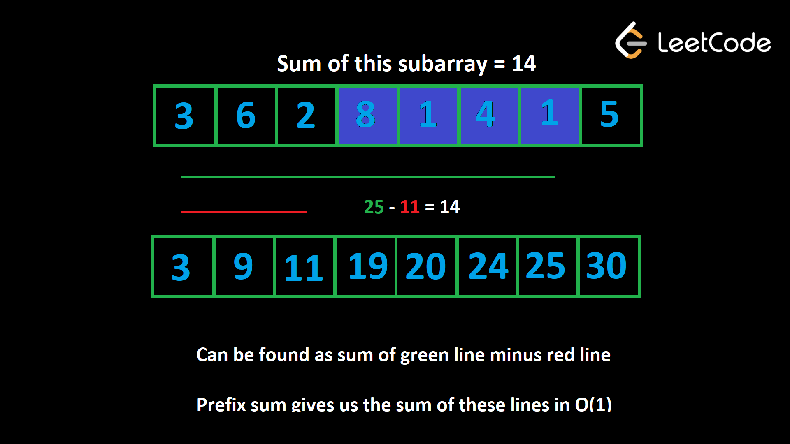

# Table of Contents
- [Table of Contents](#table-of-contents)
  - [Prefix sum](#prefix-sum)

## Prefix sum

Prefix sum is a technique that can be used on arrays (of numbers, usually). The idea is to create an array `prefix` where `prefix[i]` is the sum of all elements up to the index `i` (inclusive). For example, given `nums = [5, 2, 1, 6, 3, 8]`, we would have `prefix = [5, 7, 8, 14, 17, 25]`.

> When a subarray starts at index `0`, it is considered a "prefix" of the array. A prefix sum represents the sum of all prefixes.

Prefix sums allow us to find the sum of any subarray in $O(1)$. If we want the sum of the subarray from `i` to `j` (inclusive), then the answer is `prefix[j] - prefix[i - 1]`, or alternatively `prefix[j] - prefix[i] + nums[i]` if you don't want to deal with the out of bounds case when `i = 0`.

This works because `prefix[i - 1]` is the sum of all elements **before** index `i`. When you subtract this from the sum of all elements up to index `j`, you are left with the sum of all elements starting at index `i` and ending at index `j`, which is exactly what we are looking for.



Building a prefix sum is very simple. Here's some pseudocode:

```
Given an array nums,

prefix = [nums[0]]
for (int i = 1; i < nums.length; i++)
    prefix.append(nums[i] + prefix[prefix.length - 1])
```

Initially, we start with just the first element. Then we iterate with `i` starting from index `1`. At any given point, the last element of `prefix` will represent the sum of all the elements in the input up to but not including index `i`. So we can add that value plus the current value to the end of `prefix` and continue to the next element.

A prefix sum is a great tool whenever a problem involves sums of a subarray. It only costs  $O(n)$ to build but allows all future subarray queries to be $O(1)$, so it can usually improve an algorithm's time complexity by a factor of $O(n)$, where $n$ is the length of the array. Let's look at some examples.

> Building a prefix sum is a form of **pre-processing**. Pre-processing is a useful strategy in a variety of problems where we store pre-computed data in a data structure before running the main logic of our algorithm. While it takes some time to pre-process, it's an investment that will save us a huge amount of time during the main parts of the algorithm.


**Example 1**

> Given an integer array `nums`, an array `queries` where `queries[i] = [x, y]` and an integer limit, return a boolean array that represents the answer to each query. A query is `true` if the sum of the subarray from `x` to `y` is less than `limit`, or `false` otherwise.

> For example, given `nums = [1, 6, 3, 2, 7, 2]`, `queries = [[0, 3], [2, 5], [2, 4]]`, and `limit = 13`, the answer is `[true, false, true]`. For each query, the subarray sums are `[12, 14, 12]`.

Let's build a prefix sum and then use the method described above to answer each query in $O(1)$.

```python
def answer_queries(nums, queries, limit):
    prefix = [nums[0]]
    for i in range(1, len(nums)):
        prefix.append(nums[i] + prefix[-1])
    
    ans = []
    for x, y in queries:
        curr = prefix[y] - prefix[x] + nums[x]
        ans.append(curr < limit)

    return ans
```

Without the prefix sum, answering each query would be $O(n)$ in the worst case, where $n$ is the length of nums. If m = queries.length, that would give a time complexity of $O(n∗m)$. With the prefix sum, it costs 
$O(n)$ to build, but then answering each query is $O(1)$. This gives a much better time complexity of $O(n+m)$. We use  $O(n)$ space to build the prefix sum.

**Example 2**
> [2270. Number of Ways to Split Array](https://leetcode.com/problems/number-of-ways-to-split-array/description/)

> Given an integer array `nums`, find the number of ways to split the array into two parts so that the first section has a sum greater than or equal to the sum of the second section. The second section should have at least one number.

A brute force approach would be to iterate over each index `i` from `0` until `nums.length - 1`. For each index, iterate from `0` to `i` to find the sum of the left section, and then iterate from `i + 1` until the end of the array to find the sum of the right section. This algorithm would have a time complexity of $O(n^2)$.

If we build a prefix sum first, then iterate over each index, we can calculate the sums of the left and right sections in $O(1)$, which would improve the time complexity to $O(n)$.

```python
class Solution:
    def waysToSplitArray(self, nums: List[int]) -> int:
        n = len(nums)
        
        prefix = [nums[0]]
        for i in range(1, n):
            prefix.append(nums[i] + prefix[-1])

        ans = 0
        for i in range(n - 1):
            left_section = prefix[i]
            right_section = prefix[-1] - prefix[i]
            if left_section >= right_section:
                ans += 1

        return ans
```

**Do we need the array?**

In this problem, the order in which we need to access `prefix` is incremental: to find `leftSection`, we do `prefix[i]` as `i` increments by `1` each iteration.

As such, to calculate `leftSection` we don't actually need the array. We can just initialize `leftSection = 0` and then calculate it on the fly by adding the current element to it at each iteration.

What about `rightSection`? By definition, the right section contains all the numbers in the array that aren't in the left section. Therefore, we can pre-compute the sum of the entire input as `total`, then calculate `rightSection` as `total - leftSection`.


```python
class Solution:
    def waysToSplitArray(self, nums: List[int]) -> int:
        ans = left_section = 0
        total = sum(nums)

        for i in range(len(nums) - 1):
            left_section += nums[i]
            right_section = total - left_section
            if left_section >= right_section:
                ans += 1

        return ans
```

We have improved the space complexity to $O(1)$, which is a great improvement.