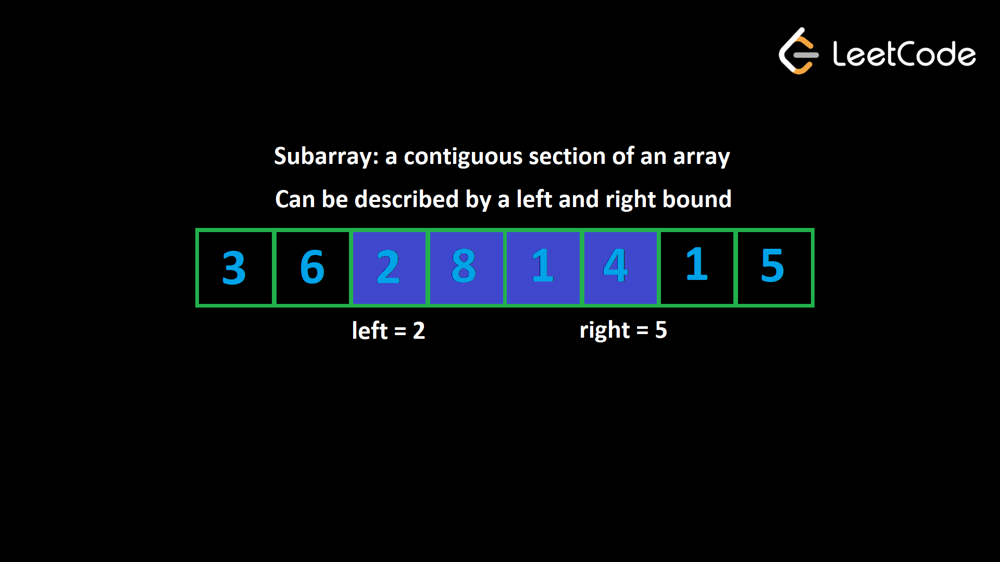
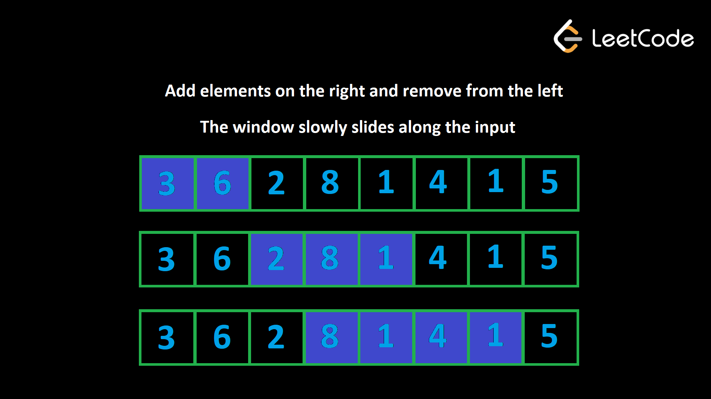

# Table of Contents
- [Table of Contents](#table-of-contents)
  - [Subarrays](#subarrays)
  - ["Valid" subarrays](#valid-subarrays)
  - [The idea](#the-idea)
  - [Solving problems with sliding window](#solving-problems-with-sliding-window)
  - [Implementation](#implementation)
  - [Why is sliding window efficient?](#why-is-sliding-window-efficient)
    - [Example 1](#example-1)
    - [Example 2:](#example-2)
  - [Number of subarrays](#number-of-subarrays)
    - [Example 3:](#example-3)
  - [Fixed window size](#fixed-window-size)
    - [Example 4](#example-4)

> Like two pointers, sliding windows work the same with arrays and strings - the important thing is that they're iterables with ordered elements. For the sake of brevity, the first part of this article up until the examples will be focusing on arrays. However, all the logic is identical for strings.

Sliding window is another common approach to solving problems related to arrays. A sliding window is actually implemented using two pointers! Before we start, we need to talk about the concept of a **subarray**.

## Subarrays

Given an array, a **subarray** is a contiguous section of the array. All the elements must be adjacent to each other in the original array and in their original order. For example, with the array `[1, 2, 3, 4]`, the subarrays (grouped by length) are:

- Subarrays with length 1: `[1]`, `[2]`, `[3]`, `[4]`
- Subarrays with length 2: `[1, 2]`, `[2, 3]`, `[3, 4]`
- Subarrays with length 3: `[1, 2, 3]`, `[2, 3, 4]`
- Subarrays with length 4: `[1, 2, 3, 4]`

A subarray can be defined by two indices, the start and end. For example, with `[1, 2, 3, 4]`, the subarray `[2, 3]` has a starting index of `1` and an ending index of `2`. Let's call the starting index the **left bound** and the ending index the **right bound**. Another name for subarray in this context is "window".



## "Valid" subarrays

A common pattern you'll see in array problems involves the idea of a "valid" subarray. The problem description will either explicitly or implicitly define what makes a subarray "valid". We can split it into two parts:

1) A constraint metric. This is an attribute of a subarray.

- For example, the sum of the subarray, the number of unique elements in the subarray, the frequency of a specific element, etc.

2) A numeric restriction on the constraint metric.  

- For example, let's say a problem declares a subarray is valid if it has a sum less than or equal to `10`. The constraint metric here is the sum of the subarray, and the numeric restriction is `<= 10`. A subarray is considered valid if its constraint metric conforms to the numeric restriction, i.e., the sum is less than or equal to `10`.

## The idea

Sliding window is used to analyze and find the valid subarrays of an array. The idea behind a sliding window is to maintain two variables, `left` and `right`. At any given time, `left` represents the left bound of our window, and right represents the `right` bound of our window. Remember that "window" here is another word for subarray.

Initially, we set `left = right = 0`, which means that the first window we consider is just the first element of the array on its own. We want to expand the size of our "window", and we do that by incrementing `right`. When we increment `right`, this is like "adding" a new element to our window.

But what if after adding a new element, the subarray becomes invalid? For example, let's say adding a new element on the right makes the sum of the subarray too large. We need to "remove" some elements from our window until it becomes valid again. To "remove" elements, we can increment `left`, which shrinks our window.



To explain why this algorithm works, let's look at a specific example. Let's say that we are given a positive integer array `nums` and an integer `k`. We need to find the length of the longest subarray that has a sum less than or equal to `k`. For this example, let `nums = [3, 2, 1, 3, 1, 1]` and `k = 5`.

Initially, we have `left = right = 0`, so our window is only the first element: `[3]`. Now, let's expand to the right until the constraint is broken. This will occur when `left = 0, right = 2`, and our window is: `[3, 2, 1]`. The sum here is `6`, which is greater than `k`. We must now shrink the window from the left until the constraint is no longer broken. After removing one element, the window becomes valid again: `[2, 1]`.

Why is it correct to remove this `3` and forget about it for the rest of the algorithm? Because the input only has positive integers, a longer subarray directly equals a larger sum. We know that `[3, 2, 1]` already results in a sum that is too large. There is no way for us to ever have a valid window again if we keep this `3` because if we were to add any more elements from the right, the sum would only get larger, and it's not like we can include the `3` without also including the `2` or `1`, since that would violate the definition of a subarray. That's why we can forget about the `3` for the rest of the algorithm.

## Solving problems with sliding window

Whenever you see a problem that not only describes subarrays being "valid", but also asks you to find these subarrays, you should immediately think about sliding window.

Often, the problem will ask you to find the **best** valid subarray. The problem will define what makes one subarray **better** than another. For example, a problem might ask you to find the **longest** valid subarray.

Another common type of problem is one that asks you to find the number of valid subarrays. We will take a deeper look at this type of problem later in the article.

Here is a preview of some of the example problems that we will look at in this article, to help you better understand what sliding window problems look like:

- Find the longest subarray with a sum less than or equal to `k` (constraint metric = sum)
- Find the longest substring that has at most one `"0"` (constraint metric = number of zeroes)
- Find the number of subarrays that have a product less than `k` (constraint metric = product)

## Implementation

Now that you have an idea of how sliding window works, let's talk about how to implement it. For this section, we will use the previous example (find the longest subarray with a sum less than or equal to `k`).

First, we need to identify the **constraint metric**. In our example, the constraint metric is the sum of the window. How do we keep track of the sum of the window as elements are added and removed? One way that we could do it is by keeping the window in a separate array. When we add elements from the right, we add them to our array. When we remove elements from the left, we remove the corresponding elements from the array. This way, we can always find the sum of our current window just by summing the elements in the separate array.

This is very inefficient as removing elements and finding the sum of the window will be $O(n)$ operations. How can we do better?

We don't actually need to store the window in a separate array. All we need is some variable, let's call it `curr`, that keeps track of the current sum. When we add a new element from the right, we just do `curr += nums[right]`. When we remove an element from the left, we just do `curr -= nums[left]`. This way, all operations are done in $O(1)$.

Next, how do we move the pointers `left` and `right`? Remember, we want to keep expanding our window, and the window always slides to the right - it just might shrink a few times along the way . Because `right` is always moving forward, we can use a for loop to iterate `right` over the input. In each iteration of the for loop, we will be adding the element `nums[right]` to our window.

What about `left?` When we move `left`, we are shrinking our window. We only shrink our window when it becomes invalid. By maintaining `curr`, we can easily tell if the current window is valid simply by checking its value. If `curr > k`, the window is invalid.

Let's say `nums = [1, 1, 1, 3]` and `k = 3`. When we arrive at the `3` and add it to the window, the window becomes invalid, and curr will be equal to `6`. We need to remove three elements from the left before the window becomes valid again.

This suggests that we should use a while loop to perform the removals. The condition will be `while curr > k` ("while the window is invalid"). To perform the removals, we do `curr -= nums[left]` and then increment `left` in each iteration of the while loop.

We now have a systematic way to slide our window across the input while maintaining its validity. How do we update the answer? In each for loop iteration, after the while loop, we know the current window is valid. We can write code here to update the answer. The formula for the length of a window is `right - left + 1` (remember this formula).

Here's some pseudocode that puts it all together:

```
function fn(nums, k):
    left = 0
    curr = 0
    answer = 0
    for (int right = 0; right < nums.length; right++):
        curr += nums[right]
        while (curr > k):
            curr -= nums[left]
            left++

        answer = max(answer, right - left + 1)

    return answer
```

Here's some pseudocode for a general template:

```
function fn(arr):
    left = 0
    for (int right = 0; right < arr.length; right++):
        Do some logic to "add" element at arr[right] to window

        while WINDOW_IS_INVALID:
            Do some logic to "remove" element at arr[left] from window
            left++

        Do some logic to update the answer
```

## Why is sliding window efficient?

For any array, how many subarrays are there? If the array has a length of `n`, there are `n` subarrays of length `1`. Then there are `n - 1 `subarrays of length `2` (every index except the last one can be a starting index), `n - 2` subarrays of length `3` and so on until there is only `1` subarray of length `n`. This means there are  $\sum_{k=1}^{n}k = \frac{n(n+1)}{2}$ subarrays (it's the partial sum of [this series](https://en.wikipedia.org/wiki/1_%2B_2_%2B_3_%2B_4_%2B_%E2%8B%AF#Partial_sums)).

In terms of time complexity, any algorithm that looks at every subarray will be at least $O(n^2)$, which is usually too slow. A sliding window guarantees a maximum of $2n$ window iterations - the right pointer can move $n$ times and the left pointer can move $n$ times. This means if the logic done for each window is $O(1)$, sliding window algorithms run in $O(n)$, which is much faster.

> You may be thinking: there is a while loop inside of the for loop, isn't the time complexity $O(n^2)$? The reason it is still $O(n)$ is that the while loop can only iterate 
n
n times in total for the entire algorithm (`left` starts at `0`, only increases, and never exceeds `n`). If the while loop were to run `n` times on one iteration of the for loop, that would mean it wouldn't run at all for all the other iterations of the for loop. This is what we refer to as [amortized analysis](https://en.wikipedia.org/wiki/Amortized_analysis) - even though the worst case for an iteration inside the for loop is $O(n)$, it averages out to $O(1)$ when you consider the entire runtime of the algorithm.

Now let's look at some sliding window examples.

### Example 1

> Given an array of positive integers `nums` and an integer `k`, find the length of the longest subarray whose sum is less than or equal to `k`. This is the problem we have been talking about above. We will now formally solve it.

```python
def find_length(nums, k):
    # curr is the current sum of the window
    left = curr = ans = 0
    for right in range(len(nums)):
        curr += nums[right]
        while curr > k:
            curr -= nums[left]
            left += 1
        ans = max(ans, right - left + 1)
    
    return ans
```

### Example 2:

> You are given a binary string `s` (a string containing only `"0"` and `"1"`). You may choose up to one `"0"` and flip it to a `"1"`. What is the length of the longest substring achievable that contains only `"1"`?

For example, given `s = "1101100111"`, the answer is `5`. If you perform the flip at index `2`, the string becomes `1111100111`.

```python
def find_length(s):
    # curr is the current number of zeros in the window
    left = curr = ans = 0 
    for right in range(len(s)):
        if s[right] == "0":
            curr += 1
        while curr > 1:
            if s[left] == "0":
                curr -= 1
            left += 1
        ans = max(ans, right - left + 1)
    
    return ans
```

Like the previous example, this problem runs in $O(n)$ time, where 
$n$ is the length of s, as the work done in each loop iteration is amortized constant. Only a few integer variables are used as well, which means this algorithm uses $O(1)$ space.

## Number of subarrays

If a problem asks for the **number of subarrays** that fit some constraint, we can still use sliding window, but we need to use a neat math trick to calculate the number of subarrays.

Let's say that we are using the sliding window algorithm we have learned and currently have a window `(left, right)`. How many valid windows **end** at index `right`?

There's the current window `(left, right)`, then `(left + 1, right)`, `(left + 2, right)`, and so on until` (right, right)` (only the element at `right`).

You can fix the right bound and then choose any value between `left` and `right` inclusive for the left bound. Therefore, the number of valid windows **ending** at index `right` is equal to the size of the window, which we know is `right - left + 1`.

### Example 3: 
[713. Subarray Product Less Than K.](https://leetcode.com/problems/subarray-product-less-than-k/)

> Given an array of positive integers `nums` and an integer `k`, return the number of subarrays where the product of all the elements in the subarray is strictly less than `k`.  

> For example, given the input `nums = [10, 5, 2, 6]`, `k = 100`, the answer is `8`. The subarrays with products less than k are: `[10]`, `[5]`, `[2]`, `[6]`, `[10, 5]`, `[5, 2]`, `[2, 6]`, `[5, 2, 6]`.

```python
class Solution:
    def numSubarrayProductLessThanK(self, nums: List[int], k: int) -> int:
        if k <= 1:
            return 0

        ans = left = 0
        curr = 1

        for right in range(len(nums)):
            curr *= nums[right]
            while curr >= k:
                curr //= nums[left]
                left += 1
                
            ans += right - left + 1

        return ans
```

Again, the work done in each loop iteration is amortized constant, so this algorithm has a runtime of $O(n)$, where $n$ is the length of nums, and $O(1)$ space.

## Fixed window size

In the examples we looked at above, our window size was dynamic. We tried to expand it to the right as much as we could while keeping the window within some constraint and removed elements from the left when the constraint was violated. Sometimes, a problem will specify a **fixed** length `k`.

These problems are easy because the difference between any two adjacent windows is only two elements (we add one element on the right and remove one element on the left to maintain the length).

Start by building the first window (from index `0` to `k - 1`). Once we have a window of size `k`, if we add an element at index `i`, we need to remove the element at index `i - k`. For example, `k = 2` and you currently have elements at indices `[0, 1]`. Now, we add `2`: `[0, 1, 2]`. To keep the window size at `k = 2`, we need to remove `2 - k = 0`: `[1, 2]`.

Here's some pseudocode:

```
function fn(arr, k):
    curr = some data to track the window

    // build the first window
    for (int i = 0; i < k; i++)
        Do something with curr or other variables to build first window

    ans = answer variable, probably equal to curr here depending on the problem
    for (int i = k; i < arr.length; i++)
        Add arr[i] to window
        Remove arr[i - k] from window
        Update ans

    return ans
```

### Example 4

> Given an integer array `nums` and an integer `k`, find the sum of the subarray with the largest sum whose length is `k`.

As we mentioned before, we can build a window of length `k` and then slide it along the array. Add and remove one element at a time to make sure the window stays size `k`. If we are adding the value at `i`, then we need to remove the value at `i - k`.

After we build the first window we initialize our answer to `curr` to consider the first window's sum.

```python
def find_best_subarray(nums, k):
    curr = 0
    for i in range(k):
        curr += nums[i]
    
    ans = curr
    for i in range(k, len(nums)):
        curr += nums[i] - nums[i - k]
        ans = max(ans, curr)
    
    return ans
```

The total for loop iterations is equal to $n$, where 
$n$ is the length of nums, and the work done in each iteration is constant, giving this algorithm a time complexity of $O(n)$, using $O(1)$ space.