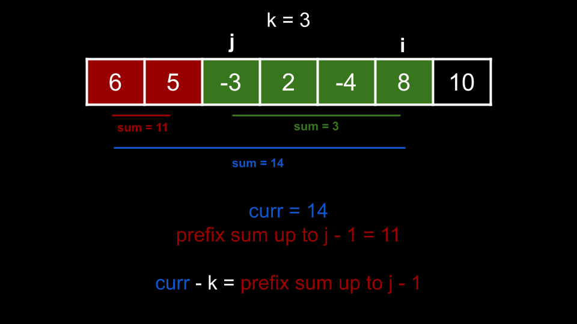

# Table of Contents
- [Table of Contents](#table-of-contents)
  - [Counting](#counting)
  - [Count the number of subarrays with an "exact" constraint](#count-the-number-of-subarrays-with-an-exact-constraint)


## Counting

Counting is a very common pattern with hash maps. By "counting", we are referring to tracking the frequency of things. This means our hash map will be mapping keys to integers. Anytime you need to count anything, think about using a hash map to do it.

Recall that when we were looking at sliding windows, some problems had their constraint as limiting the amount of a certain element in the window. For example, longest substring with at most `k` 0s. In those problems, we could simply use an integer variable `curr` because we are only focused on one element (we only cared about `0`). A hash map opens the door to solving problems where the constraint involves multiple elements. Let's start by looking at a sliding window example that leverages a hash map.

**Example 1:**

> You are given a string `s` and an integer `k`. Find the length of the longest substring that contains **at most** `k` distinct characters.

> For example, given `s = "eceba"` and `k = 2`, return `3`. The longest substring with at most 2 distinct characters is `"ece"`.

This problem deals with substrings and has a constraint on the substrings (at most k distinct characters). These characteristics let us know that we should consider sliding window. Remember, the idea of a sliding window is to add elements by sliding to the right until the window violates the constraint. Once it does, we shrink the window from the left until it no longer violates the constraint. In this problem, we are concerned with the number of distinct characters in the window. The brute force way to check for this constraint would be to check the entire window every time, which could take $O(n)$ time. Using a hash map, we can check the constraint in $O(1)$.

Let's use a hash map `counts` to keep count of the characters in the window. This means we will map letters to their frequency. The length (number of keys) in `counts` at any time is the number of distinct characters. When we remove from the left, we can decrement the frequency of the elements being removed. When the frequency becomes `0`, we know this character is no longer part of the window, and we can delete the key.

> In Python, the collections module provides very useful data structures. We will be using a (defaultdict)[https://docs.python.org/3/library/collections.html#collections.defaultdict] in the Python code. Functionality-wise, a defaultdict is the same as a hash map, it's just more pleasant to work with.

```python
from collections import defaultdict

def find_longest_substring(s, k):
    counts = defaultdict(int)
    left = ans = 0
    for right in range(len(s)):
        counts[s[right]] += 1
        while len(counts) > k:
            counts[s[left]] -= 1
            if counts[s[left]] == 0:
                del counts[s[left]]
            left += 1
        
        ans = max(ans, right - left + 1)
    
    return ans
```

As you can see, using a hash map to store the frequency of any key we want allows us to solve sliding window problems that put constraints on multiple elements. We know from earlier that the time complexity of sliding window problems are $O(n)$ if the work done inside each for loop iteration is amortized constant, which is the case here due to a hash map having $O(1)$ operations. The hash map occupies $O(k)$ space, as the algorithm will delete elements from the hash map once it grows beyond $k$.

**Example 2:**

[2248. Intersection of Multiple Arrays](https://leetcode.com/problems/intersection-of-multiple-arrays/)

> Given a 2D array `nums` that contains `n` arrays of distinct integers, return a sorted array containing all the numbers that appear in all `n` arrays.

> For example, given `nums = [[3,1,2,4,5],[1,2,3,4],[3,4,5,6]]`, return `[3, 4]`. `3` and `4` are the only numbers that are in all arrays.

The problem states that each individual array contains **distinct** integers. This means that a number appears `n` times if and only if it appears in all arrays.

Let's use a hash map `counts` to count the frequency of elements. We iterate over each of the inner arrays and update `counts` with every element. After going through all the arrays, we can iterate over our hash map to see which numbers appear `n` times.

```python
from collections import defaultdict

class Solution:
    def intersection(self, nums: List[List[int]]) -> List[int]:
        counts = defaultdict(int)
        for arr in nums:
            for x in arr:
                counts[x] += 1

        n = len(nums)
        ans = []
        for key in counts:
            if counts[key] == n:
                ans.append(key)
        
        return sorted(ans)
```

This problem is a good discussion point for why a hash map is convenient. You may be thinking, since our keys are integers, why can't we just use an array instead of a hash map? We could, but the problem is that the array needs to be at least as large as the maximum element. What if we have a test case like `[1, 2, 3, 1000]`? We need to initialize an array of size `1001` (to use `arr[1000]` to track how many times `1000` appears), and nearly all of the indices will be unused. Therefore, using an array could end up being a huge waste of space. Sure, sometimes it would be more efficient because of the overhead of a hash map, but overall, a hash map is much safer. Even if `99999999999` is in the input, it doesn't matter - the hash map handles it like any other element.

Let's say that there are $n$ lists and each list has an average of 
$m$ elements. To populate our hash map, it costs $O(n⋅m)$ to iterate over all the elements. The next loop iterates over all unique elements that we encountered. If all elements are unique, this can cost up to $O(n⋅m)$, although this won't affect our time complexity since the previous loop also cost $O(n⋅m)$. Finally, there can be at most 
$m$ elements inside `ans` when we perform the sort, which means in the worst case, the sort will cost $O(m⋅logm)$. This gives us a time complexity of 
$O(n⋅m+m⋅logm)=O(m⋅(n+logm))$. If every element in the input is unique, then the hash map will grow to a size of $n⋅m$, which means the algorithm has a space complexity of $O(n⋅m)$.

**Example 3**

[1941. Check if All Characters Have Equal Number of Occurrences](https://leetcode.com/problems/check-if-all-characters-have-equal-number-of-occurrences/description/)

> Given a string `s`, determine if all characters have the same frequency.

> For example, given `s = "abacbc"`, return true, because all characters appear twice. Given `s = "aaabb"`, return false. `"a"` appears 3 times, `"b"` appears 2 times. `3 != 2`.

Using our knowledge of hash maps and sets, this is a straightforward problem. Use a hash map `counts` to count all character frequencies. Iterate through `s` and get the frequency of every character. Check if all frequencies are the same.

Because a set ignores duplicates, we can put all the frequencies in a set and check if the length is `1` to verify if the frequencies are all the same.

```python
from collections import defaultdict

class Solution:
    def areOccurrencesEqual(self, s: str) -> bool:
        counts = defaultdict(int)
        for c in s:
            counts[c] += 1
        
        frequencies = counts.values()
        return len(set(frequencies)) == 1
```

Given $n$ as the length of s, it costs $O(n)$ to populate the hash map, then $O(n)$ to convert the hash map's values to a set. This gives us a time complexity of $O(n)$. The space that the hash map and set would occupy is equal to the number of unique characters. As previously discussed, some people would argue that this is $O(1)$ since the characters come from the English alphabet, which is bounded by a constant. A more general answer would be to say that the space complexity is $O(k)$, where $k$ is the number of characters that could be in the input, which happens to be 26 in this problem.

Bonus Python one liner using collection's [Counter](https://docs.python.org/3/library/collections.html#collections.Counter):

```python
from collections import Counter

class Solution:
    def areOccurrencesEqual(self, s: str) -> bool:
        return len(set(Counter(s).values())) == 1
```

## Count the number of subarrays with an "exact" constraint

In the sliding window article from chapter 1, we talked about a pattern "find the number of subarrays/substrings that fit a constraint". In those problems, if you had a window between `left` and `right` that fit the constraint, then all windows from i to `right` also fit the constraint, where `left < i <= right`.

For this pattern, we will be looking at problems with stricter constraints, so that the property just mentioned is not necessarily true.

> For example, "Find the number of subarrays that have a sum less than k" with an input that **only has positive numbers** would be solved with sliding window. In this section, we would be talking about questions like "Find the number of subarrays that have a sum **exactly equal** to `k`".

At first, some of these problems may seem very difficult. However, the pattern is very simple once you learn it, and you'll see how similar the code is for each problem that falls in this pattern. To understand the algorithm, we need to recall the concept of prefix sums.

The sum of any subarray can be found as the difference between two prefix sums. Let's say that you wanted to find subarrays that had a sum exactly equal to `k`, and you also had a prefix sum array of the input. You know that any difference in the prefix sum array equal to `k` represents a subarray with a sum equal to `k`. So how do we find these differences?

Let's first declare a hash map `counts` that maps prefix sums to how often they occur (a number could appear multiple times in a prefix sum if the input has negative numbers or zeroes, for example, given `nums = [1, -1, 1]`, the prefix sum is `[1, 0, 1]` and `1` appears twice). We need to initialize `counts[0] = 1`. This is because the empty prefix `[]` has a sum of `0`. You'll see why this is necessary in a second.

Now, let's iterate over the input and maintain the sum of the current prefix in a variable `curr`. At any given time, `curr` represents the sum of all the elements we have iterated over so far. We'll also maintain `counts` by incrementing the frequency of `curr` at each iteration. Remember, `counts` is counting how many times a sum has appeared in a prefix.

The big question: how do we calculate the answer? Recall that in the sliding window article, when we were looking for the "number of subarrays", we focused on each index and figured out how many valid subarrays **ended** at the current index. Essentially, we locked in the right bound and calculated how many left bounds could match it. We will do the same thing here. Let's say that we're at an index `i`. We know a few things:

- Up until this point, `curr` stores the prefix of all elements up to `i`.
- We have stored all other prefixes before `i` inside of `counts`.
- The difference between any two prefix sums represents a subarray. For example, if you wanted the subarray starting at index `3` and ending at index `8`, you would take the prefix up to `8` and subtract the prefix up to `2` from it.

Now, imagine there exists a subarray that beginning at index `j` and ending at index `i` with a sum of `k`. Consider the sum of the prefix ending at `j - 1` (the elements up to, but not including the start of the subarray). According to our assumptions:

- The sum of the prefix up to `i` is `curr`.
- The sum of the subarray from `j` to `i` is `k`.

Thus, the sum of the prefix ending at `j - 1` must be `curr - k`.



> In this image, the subarray between `j` and `i` has a sum of `k`. The sum of the prefix ending at `i` is `14` (which we keep track of in `curr`). At some point earlier, `curr` was equal to `11` (the prefix ending before `j`). This is equal to `curr - k`.

This is the key idea: if we saw the prefix sum `curr - k` before, it **necessarily implies** that there is a subarray ending at `i` with a sum of `k`. We don't know where the beginning of this subarray is; we just know it exists, but that's enough to solve the problem.

Therefore, we can increment our answer by `counts[curr - k]`. If the prefix `curr - k` occurred multiple times before (due to negative numbers or zero), then each of those prefixes could be used as a starting point to form a subarray ending at the current index with a sum of `k`. That's why we need to track the frequency.

> Let's use a concrete example to better illustrate this idea. Imagine we had `nums = [0, 1, 2, 3, 4]` and `k = 5`. Let's jump to `i = 3`.

> Currently, `curr = 6` (remember, curr is tracking the prefix sum up to `i`). We also have `0`, `1`, and `3` in `counts` (all the prefix sums we have encountered so far).

> At this point, we can see that there is a subarray ending at `i` with a sum of `k` - it's `[2, 3]`. How does our algorithm see it though?

> The current prefix sum is `6`. We want a subarray with a sum of `5`. Thus, if there was a prefix sum of `1` earlier, you could just subtract that prefix from the current one, and you'll get a subarray sum of `5`. In this case, we had a prefix `[0, 1]` which has a prefix sum of `1`. We can subtract that from the current prefix `[0, 1, 2, 3]` and we're left with `[2, 3]`, which has our target sum.

**Example 4:**
[560. Subarray Sum Equals K](https://leetcode.com/problems/subarray-sum-equals-k/description/)

> Given an integer array `nums` and an integer `k`, find the number of subarrays whose sum is equal to `k`.

Let's walk through an example to see why the algorithm described above works for this problem. Let's say we have `nums = [1, 2, 1, 2, 1]`, `k = 3`. There are four subarrays with sum `3` - `[1, 2]` twice and `[2, 1]` twice.

The prefix sum for this input, which is what curr represents during iteration, is `[1, 3, 4, 6, 7]`. You can see that there are three differences in this array of `3`: `(4 - 1)`, `(6 - 3)`, `(7 - 4)`.

But we said that there are four valid subarrays? Recall that we need to initialize our hash map with `0: 1`, considering the empty prefix. This is because if there is a prefix with a sum equal to `k`, then without initializing `0: 1`, `curr - k = 0` wouldn't show up in the hash map and we would "lose" this valid subarray.

So at indices 1, 2, 3, and 4, we find `curr - k` has been seen prior. The elements are all positive so each value of `curr - k` only showed up once, and hence our answer is `4`.

```python
from collections import defaultdict

class Solution:
    def subarraySum(self, nums: List[int], k: int) -> int:
        counts = defaultdict(int)
        counts[0] = 1
        ans = curr = 0

        for num in nums:
            curr += num
            ans += counts[curr - k]
            counts[curr] += 1
    
        return ans
```

**Example 5:**
[1248. Count Number of Nice Subarrays](https://leetcode.com/problems/count-number-of-nice-subarrays/description/)

Given an array of positive integers `nums` and an integer `k`. Find the number of subarrays with exactly `k` odd numbers in them.

For example, given `nums = [1, 1, 2, 1, 1]`, `k = 3`, the answer is `2`. The subarrays with `3` odd numbers in them are `[1, 1, 2, 1, x]` and `[x, 1, 2, 1, 1]`.

In the previous example, the constraint metric was a sum, so we had `curr` record a prefix sum. In this problem, the constraint metric is odd number count. Therefore, let's have `curr` track the count of odd numbers. At every element, we can query `curr - k` again. In the example test case, at the final index, `curr = 4` because there are `4` odd numbers in the array. At the first index, `curr = 1`. This means that the subarray starting after the first index until the last index has `4 - 1 = 3 = k` odd numbers, and you can see that the subarray from index `1` to `4` is one of the answers `([x, 1, 2, 1, 1])`.

> We can check if a number is odd by taking it mod 2. If `x` is odd, then `x % 2 = 1`.

```python
from collections import defaultdict

class Solution:
    def numberOfSubarrays(self, nums: List[int], k: int) -> int:
        counts = defaultdict(int)
        counts[0] = 1
        ans = curr = 0
        
        for num in nums:
            curr += num % 2
            ans += counts[curr - k]
            counts[curr] += 1

        return ans
```

The time and space complexity of this algorithm is identical to the previous problem's ($O(n)$ for both).