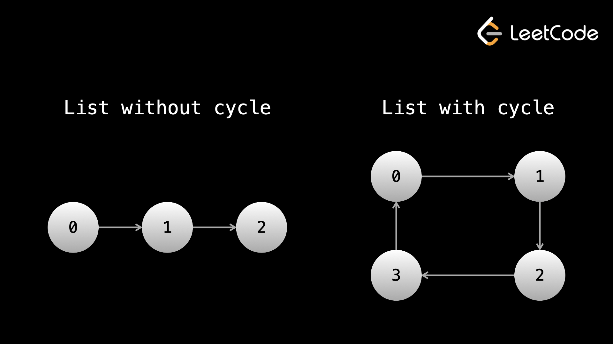

# Table of Contents
- [Table of Contents](#table-of-contents)
  - [Fast and slow pointers](#fast-and-slow-pointers)

## Fast and slow pointers

Fast and slow pointers is an implementation of the two pointers technique that we learned in the arrays and strings chapter. The idea is to have two pointers that don't move side by side. This could mean they move at different "speeds" during iteration, begin iteration from different locations, or any other abstract difference.

When the pointers move at different speeds, usually the "fast" pointer moves two nodes per iteration, whereas the "slow" pointer moves one node per iteration (although this is not always the case). Here's some pseudocode:

```
// head is the head node of a linked list
function fn(head):
    slow = head
    fast = head

    while fast and fast.next:
        Do something here
        slow = slow.next
        fast = fast.next.next
```

> The reason we need the while condition to also check for `fast.next` is because if `fast` is at the final node, then `fast.next` is null, and trying to access `fast.next.next` would result in an error (you would be doing `null.next`).

Let's look at some examples where fast and slow pointers can come in handy.

**Example 1:**
> Given the head of a linked list with an odd number of nodes `head`, return the value of the node in the middle.

> For example, given a linked list that represents `1 -> 2 -> 3 -> 4 -> 5`, return `3`.

As mentioned in the previous article, the easiest way to solve this problem would be to just convert the linked list into an array by iterating over it, and then just returning the number in the middle.

```
function fn(head):
    array = int[]
    while head:
        array.push(head.val)
        head = head.next

    return array[array.length // 2]
```

This is basically "cheating", and would never pass as an acceptable solution in an interview. You may have realized that the difficulty in this problem comes from the fact that we don't know how long the linked list is. One thing we could do is iterate through the linked list once with a dummy pointer to find the length, then iterate from the head again once we know the length to find the middle.

```python
def get_middle(head):
    length = 0
    dummy = head
    while dummy:
        length += 1
        dummy = dummy.next
    
    for _ in range(length // 2):
        head = head.next
    
    return head.val
```

The most elegant solution comes from using the fast and slow pointer technique. If we have one pointer moving twice as fast as the other, then by the time it reaches the end, the slow pointer will be halfway through since it is moving at half the speed.

```python
def get_middle(head):
    slow = head
    fast = head
    while fast and fast.next:
        slow = slow.next
        fast = fast.next.next
    
    return slow.val
```

The pointers use $O(1)$ space, and if there are $n$ nodes in the linked list, the time complexity is $O(n)$ for the traversals.

> Example 2: 141. [Linked List Cycle](https://leetcode.com/problems/linked-list-cycle/)

> Given the `head` of a linked list, determine if the linked list has a cycle.

> There is a cycle in a linked list if there is some node in the list that can be reached again by continuously following the `next` pointer.

following the next pointer.

If a linked list has a cycle, you can imagine some group of nodes forming a circle, and traversal never ends as it moves around that circle infinitely. One way to try to solve this problem would be to just iterate through the list for an arbitrarily large amount of iterations. If there isn't a cycle, then we will eventually reach the end of the list. If there is a cycle, then we will never reach an end and after a huge amount of iterations, we can conclude that there is probably a cycle.

The problem with this approach is that it isn't an actual general solution. What if there is no cycle, but there just happens to be more nodes than the iteration cutoff? If we increase the iteration cutoff, we can always argue that we could pass in a longer linked list. If we make the cutoff too large, it becomes impractical, and we are hard coding which is a terrible practice.

The better approach is to use a fast and slow pointer. Imagine a straight racetrack (like the one used in the 100m sprint). If two runners of significantly different speeds are racing, then the slower one will never catch up to the faster one. The faster runner finishing the race is like the fast pointer reaching the end of the linked list.

But what if the runners were instead running around a circular racetrack, and needed to complete many laps? In that case, the faster runner will eventually pass (lap) the slower runner.

We can apply this logic - move a fast pointer twice the speed of a slow pointer. If they ever meet (except at the start), then we know there must be a cycle. If the fast pointer reaches the end of the linked list, then there isn't a cycle.

> Why will the pointers always meet, and the fast pointer won't just "skip" over the slow pointer in the cycle? After looping around the cycle for the first time, if the fast pointer is one position behind, then the pointers will meet on the next iteration. If the fast pointer is two positions behind, then it will be one position behind on the next iteration. This pattern continues - after looping around once, the fast pointer moves exactly one step closer to the slow pointer at each iteration, so it's impossible for it to "skip" over.




```python
class Solution:
    def hasCycle(self, head: Optional[ListNode]) -> bool:
        slow = head
        fast = head
        while fast and fast.next:
            slow = slow.next
            fast = fast.next.next
            if slow == fast:
                return True

        return False
```

This approach gives us a time complexity of $O(n)$ and a space complexity of $O(1)$, where `n` is the number of nodes in the linked list. Note that this problem can also be solved using hashing, although it would require $O(n)$ space.

The hashing solution: if you continuously iterate using the next pointer, there are two possibilities:

1. If the linked list doesn't have a cycle, you will eventually reach null and finish.
1. If the linked list has a cycle, you will eventually visit a node twice. We can use a set to detect this.

```python
class Solution:
    def hasCycle(self, head: Optional[ListNode]) -> bool:
        seen = set()
        while head:
            if head in seen:
                return True
            seen.add(head)
            head = head.next
        return False
```

This solution is added for the sake of completeness - the first one is better as it uses less space.

> Example 3: Given the head of a linked list and an integer `k`, return the $k^{th}$ node from the end.

> For example, given the linked list that represents `1 -> 2 -> 3 -> 4 -> 5` and `k = 2`, return the node with value `4`, as it is the 2nd node from the end.

This problem is very similar to the first example. Again, we could just convert the list to an array, or we could iterate through once to find the length and then iterate again once we know the length, but there is a more elegant solution.

If we separate the two pointers by a gap of k, and then move them at the same speed, they will always be k apart. When the fast pointer (the one further ahead) reaches the end, then the slow pointer must be at the desired node, since it is k nodes behind.

```python
def find_node(head, k):
    slow = head
    fast = head
    for _ in range(k):
        fast = fast.next
    
    while fast:
        slow = slow.next
        fast = fast.next
    
    return slow
```

For the same reasons as in the first example, the time complexity of this algorithm is $O(n)$ and the space complexity is $O(1)$, where $n$ is the number of nodes in the linked list.