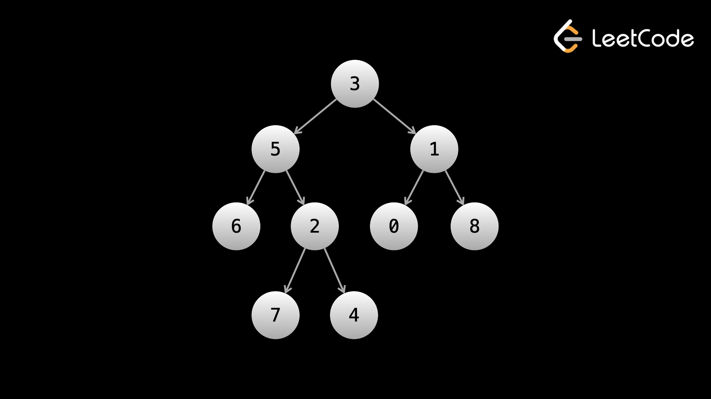
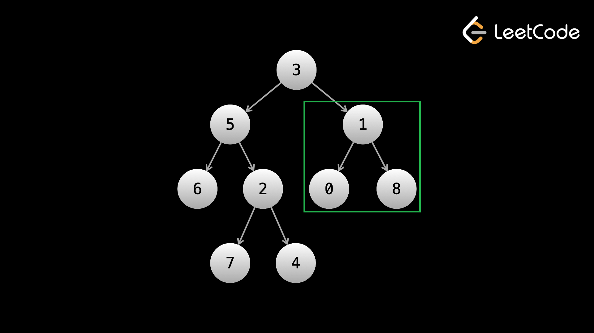

## Binary trees

### Nodes and graphs

Let's start by revisiting what a **node** is. We looked at nodes in the linked lists chapter - recall that a node is an abstract data type with two things. First, a node stores data. This data can be whatever you want - an integer, a boolean, a hash map, your own custom objects, or all of the above. Second, a node stores pointers to other nodes.

A **graph** is any collection of nodes and their pointers to other nodes. In fact, linked lists and trees are both types of graphs. As a topic, graphs are **extremely** broad. There is an entire field of study dedicated to graphs called [graph theory](https://en.wikipedia.org/wiki/Graph_theory).

Even though a tree is a type of graph, trees and graphs are considered different topics when it comes to algorithm problems.

> The nodes of a graph are also called **vertices**, and the pointers that connect them are called **edges**. In graphical representations, nodes/vertices are usually represented with circles and the edges are lines/arrows that connect the circles (we saw this in the linked lists chapter).

### What is a tree?

Like a linked list, a **tree** is a type of graph. Also like a linked list, there are multiple types of trees. In this course, we will be focusing on **binary trees**. Let's take a look at what a binary tree is.

> Recall that the start of a linked list was called the **head**. The start of a binary tree is called the **root**.

In a linked list, a node's pointer pointed to the **next** node. In a tree, a node has pointers to its **children**. If a node `A` is pointing to a node `B`, then `B` is a **child** of `A`, and `A` is the **parent** of `B`. The **root** is the only node that has no **parent**. Note that in a tree, a node cannot have more than one parent.

So what makes a binary tree "binary"? In a binary tree, all nodes have a **maximum** of two children. These children are referred to as the **left** child and the **right** child. Note that there isn't really a difference between a child being on the left or the right, it's just the convention used to refer to the children and convenient for graphical representations.

To summarize, a binary tree is a collection of nodes. Every node has between 0 to 2 children, and every node except the root has exactly one parent.

Here is an example of a binary tree:



> The node with value `3` is the root node. As you can see, every node has exactly one parent and at most 2 children. The `6` is the left child of `5` and the `4` is the right child of `2`.

Trees (not just binary trees) are implemented all around us in real life. Some examples:

- File systems
- A comment thread on an app like Reddit or Twitter
- A company's organization chart

In each of these examples, the respective root nodes and children would be:

- The root directory, and subfolders/files
- The original post/tweet, and the comments and replies
- The CEO, and direct reports

To be more specific, let's look at the company example. If we modeled the company as a tree, then each person is a node, and an edge exists from `A` to `B` if `A` manages `B`. In that case, the CEO would be the root because they are at the "top" of the company and are not managed by any other employee. Let's say the CEO has 6 direct reports - the people in the C-Suite (like CFO, COO, CTO). This means the CEO has 6 "children", which also means that this is not a binary tree. Each of the people in the C-Suite will have people reporting to them, like VPs, and those VPs will have directors reporting to them, and so on.

> The important characteristics of the company that makes it a tree are that each person only has 1 manager (parent), and the entire tree is connected (if you start at anyone and continuously trace their managers, you will always end up at the CEO).

### Tree terminology

There is some tree-specific terminology that you will need to learn.

The **root** node is the node at the "top" of the tree. Every node in the tree is accessible starting from the root node. In most tree questions, the `root` of the tree will be given as the input, just like how in linked lists, the `head` was given as the input.

If you have a node `A` with an edge to a node `B`, so `A -> B`, we call `A` the **parent** of node `B`, and node `B` a **child** of node `A`.

If a node has no children, it is called a **leaf** node. The leaf nodes are the **leaves** of the tree.

The **depth** of a node is how far it is from the root node. The root has a depth of `0`. Every child has a depth of `parentsDepth + 1`, so the root's children have a depth of 1, their children have a depth of 2, and so on.

Lastly, perhaps the most important thing to understand: a **subtree** of a tree is a node and all its descendants. Trees are recursive - you can treat a subtree as if it was its own tree with the chosen node being the root. What do we mean by this? Let's look at the company example again. The entire company is represented by the tree **rooted** at the CEO. But what if we only cared about the engineering department? Let's say the CTO has a direct report who is an SVP (Senior Vice President) of engineering, and all engineers are under this person. Take this SVP, and separate them from the rest of the company (remove their connection to the CTO). What are you left with? It's still a valid tree, but now the SVP is the **root**! This subtree now represents the engineering department instead of the entire company. This is the most fundamental idea for solving tree problems - **you can take any given node and treat it as its own tree**, which allows you to solve problems in a recursive manner.

To illustrate the concept of a subtree, take a look at the following image:



Enclosed in the green box is the subtree rooted at the node with value `1`. This can be called the right subtree of the node with value `3` (the root). Notice that this subtree is a binary tree itself.

### Code representation

Just like with a linked list, binary trees are implemented using objects of a custom class. This is the typical class definition that will be provided to you in algorithm problems:

```python
class TreeNode:
    def __init__(self, val, left, right):
        self.val = val
        self.left = left
        self.right = right
```

In binary tree problems, you will be given a reference to the `root` of a binary tree as the input. You can access the root's left **subtree** with `root.left` and the root's right **subtree** with `root.right`. Like with linked lists, each node will also carry a value `val` as data. In a linked list, the tail (last node) has its `next` pointer as null. In a binary tree, if a node does not have a left child, then `node.left` will be `null`, and vice-versa with the right child. Remember that if both children are null, then the node is a **leaf**.