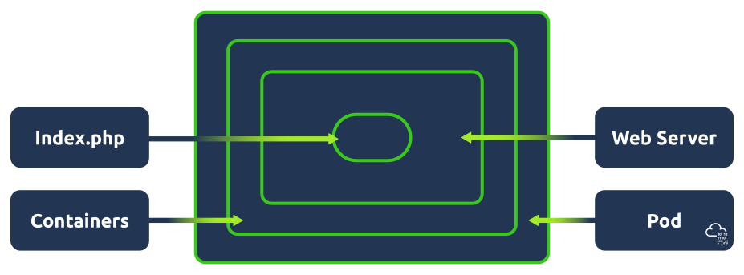
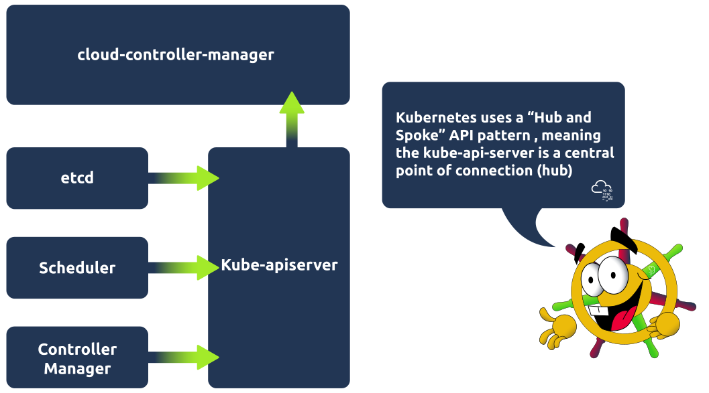
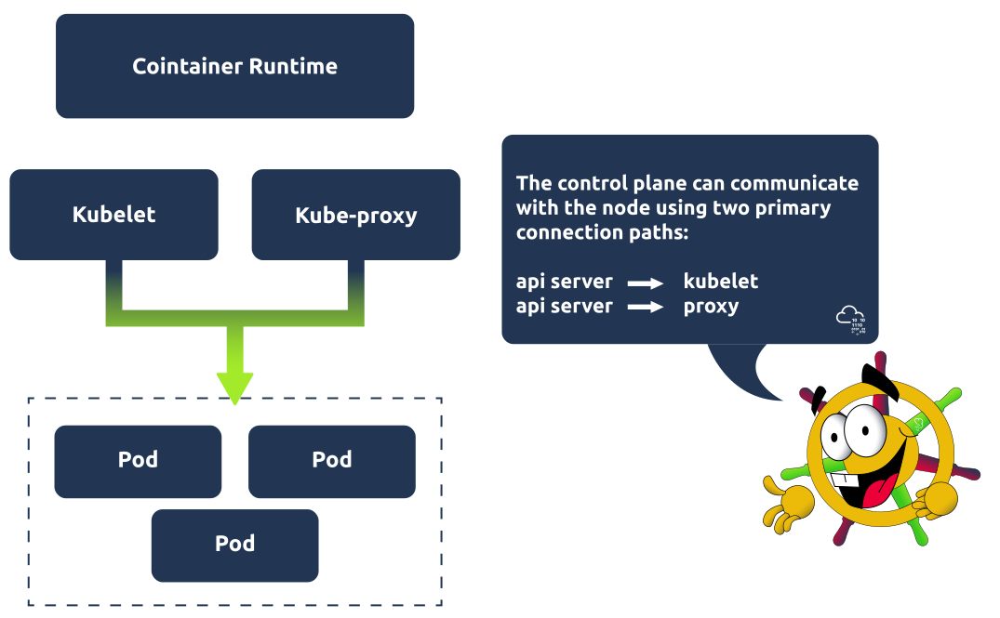
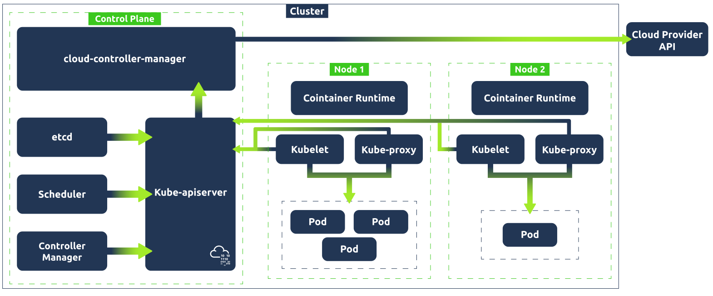

# Table of Contents
- [Table of Contents](#table-of-contents)
  - [Kubernetes Architecture](#kubernetes-architecture)
    - [Cluster Architecture](#cluster-architecture)
    - [The Kubernetes Control Plane](#the-kubernetes-control-plane)
    - [Kubernetes Worker Node](#kubernetes-worker-node)
    - [Communication Between Components](#communication-between-components)
  - [Configuration](#configuration)
    - [Required Fields](#required-fields)
    - [Configuring Resources](#configuring-resources)
  - [Kubectl](#kubectl)
    - [Kubectl apply](#kubectl-apply)
    - [Kubectl get](#kubectl-get)
    - [Kubectl describe](#kubectl-describe)
    - [Kubectl logs](#kubectl-logs)
    - [Kubectl exec](#kubectl-exec)
    - [Kubectl port-forward](#kubectl-port-forward)
  - [References](#references)

## Kubernetes Architecture

### Cluster Architecture 

**Kubernetes Pod**

Pods are the smallest deployable unit of computing you can create and manage in Kubernetes. When you work in DevSecOps with Kubernetes, you'll hear a lot of this word. You can think of a pod as a group of one or more containers. These containers share storage and network resources. Because of this, containers on the same pod can communicate easily as if they were on the same machine whilst maintaining a degree of isolation. Pods are treated as a unit of replication in Kubernetes; if a workload needs to be scaled up, you will increase the number of pods running.

<p align="center">
     
</p>

**Kubernetes Nodes**

Kubernetes workloads (applications) are run inside containers, which are placed in a pod. These pods run on nodes. When talking about node architecture, there are two types to consider. The **control plane** (also known as "master node") and **worker nodes**. Both of these have their own architecture/components. Nodes can either be a virtual or physical machine. Think of it this way: if applications run in containers which are placed in a pod, nodes contain all the services necessary to run pods.

**Kubernetes Cluster**

At the highest level, we have our Kubernetes Cluster; put simply, a Cluster is just a set of nodes. 

### The Kubernetes Control Plane

The control plane manages the worker nodes and pods in the cluster. It does this with the use of various components.

**Kube-apiserver**

The API server is the front end of the control plane and is responsible for exposing the Kubernetes API. The kube-apiserver component is scalable, meaning multiple instances can be created so traffic can be load-balanced.

**Etcd** 

Etcd is a key/value store containing cluster data / the current state of the cluster. It is highly available and consistent. If a change is made in the cluster, for example, another pod is spun up, this will be reflected in the key/value store, etcd. The other control plane components rely on etcd as an information store and query it for information such as available resources.

**Kube-scheduler** 

The kube-scheduler component actively monitors the cluster. Its job is to catch any newly created pods that have yet to be assigned to a node and make sure it gets assigned to one. It makes this decision based on specific criteria, such as the resources used by the running application or available resources on all worker nodes

**Kube-controller-manager** 

This component is responsible for running the controller processes. There are many different types of controller processes, but one example of a controller process is the **node controller** process, which is responsible for noticing when nodes go down. The controller manager would then talk to the scheduler component to schedule a new node to come up.

**Cloud-controller-manager** 

This component enables communication between a Kubernetes cluster and a cloud provider API. The purpose of this component is to allow the separation of components that communicate internally within the cluster and those that communicate externally by interacting with a cloud provider. This also allows cloud providers to release features at their own pace.

### Kubernetes Worker Node

Worker nodes are responsible for maintaining running pods. Let's take a look at the components, which are present on every worker node, and what they are responsible for:  

**Kubelet** 

Kubelet is an agent that runs on every node in the cluster and is responsible for ensuring containers are running in a pod. Kubelet is provided with pod specifications and ensures the containers detailed in this pod specification are running and healthy! It executes actions given to it by the controller manager, for example, starting the pod with a container inside.

**Kube-proxy** 

Kube-proxy is responsible for network communication within the cluster. It makes networking rules so traffic can flow and be directed to a pod (from inside or outside of the cluster). Traffic won't hit a pod directly but instead hit something called a Service (which would be associated with a group of pods), and then gets directed to one of the associated pods. More on services in the next task!

<p align="center">
     
</p>

**Container runtime**

Pods have containers running inside of them. A container runtime must be installed on each node for this to happen. So far, we have covered one example of this in this module, which is probably the most popular choice, Docker. However, some alternatives can be used, such as rkt or runC.

<p align="center">
     
</p>

### Communication Between Components

A Kubernetes cluster contains nodes and Kubernetes runs a workload by placing containers into pods that run on these nodes. Take a look at the graphic below to see how all these components come together.

<p align="center">
     
</p>

## Configuration

Kubernetes config files are typically written in YAML. They can also be made interchangeably using the JSON format, but as per the Kubernetes documentation, it is generally considered best practice to use YAML given its easy, human-readable nature (just gotta keep an eye on that indentation!).

### Required Fields

**apiVersion**: The version of the Kubernetes API you are going to use to create this object. The API version you use will depend on the object being defined.

**kind**: What kind of object you are going to create (e.g. Deployment, Service, StatefulSet).

**metadata**: This will contain data that can be used to uniquely identify the object (including name and an optional namespace).

**spec**: The desired state of the object (for deployment, this might be 3 nginx pods).

### Configuring Resources 

Those are the very basics of Kubernetes YAML configuration files. Let's consider those and look now at the two files. We're going to take a look at the service config file first, as when defining a deployment and service, it is generally best practice to first define the service before the back-end deployment/replicaset that it points to (this is because when Kubernetes starts a container, it creates an env variable for each service that was running when a container started). Here is what example-service.yaml file looks like:

```yml
apiVersion: v1
kind: Service
metadata:
  name: example-nginx-service
spec:
  selector:
    app: nginx
  ports:
    - protocol: TCP
      port: 8080
      targetPort: 80
  type: ClusterIP
```

Let's break that down: **apiVersion** is set to v1 (the version of the Kubernetes API best used for this simple service example), and **kind** is set to service. For the **metadata**, we just called this service "example-nginx-service". The **spec** is where it gets more interesting, under 'selector', we have 'app: nginx'. This is going to be important going forward when we define our deployment configuration, as is the **ports** information, as we are essentially saying here: "This service will look for apps with the nginx label and will target port 80. An important distinction to make here is between the 'port' and 'targetPort' fields. The 'targetPort' is the port to which the service will send requests, i.e., the port the pods will be listening on. The 'port' is the port the service is exposed on. Finally, the 'type' is defined as ClusterIP, which is the default service type. Now let's take a look at the Deployment YAML and define the back end which this service will point to:

```yml
apiVersion: apps/v1
kind: Deployment
metadata:
  name: example-nginx-deployment
spec:
  replicas: 3
  selector:
    matchLabels:
      app: nginx
  template:
    metadata:
      labels:
        app: nginx
    spec:
      containers:
      - name: nginx
        image: nginx:latest
        ports:
        - containerPort: 80
```
The first thing you might notice is that inside the 'spec' field, there is a nested field called 'template', which itself contains a 'metadata' and 'spec' field. To understand this, remember the image at the start of this task. We are defining a deployment which controls a ReplicaSet; here, in the outer 'spec' field, we tell Kubernetes we want 3 replicas (identical pods) in this ReplicaSet. This template field is the template that Kubernetes will use to create those pods and so requires its own metadata field (so the pod can be identified) and spec field (so Kubernetes knows what image to run and which port to listen on). Note that the port defined here is the same as the one in the service YAML. This is because the service's target port is 80 and needs to match. As well as this, in the outer 'spec' field, you can see we have also set the 'selector' field to have a 'matchLabels', which matches what we defined in the 'selector' field for the service YAML. This is so the service is mapped to the correct pods. With these two config YAML files, we have defined a deployment that controls a ReplicaSet that manages 3 pods, all of which are exposed to a service.

These config files are used to define the desired state of Kubernetes components; Kubernetes will constantly be checking this desired state against the current state of the cluster. Using the etcd (one of the control plane processes mentioned in an earlier task), Kubernetes populates these configuration files with the current state and does this comparison. For example, if we have told Kubernetes we want 3 nginx pods running, and it detects in the status that there are only 2 running pods, it will begin the actions to correct this.

## Kubectl 

Simply, kubectl is a command line tool provided by Kubernetes that allows us to communicate with a Kubernetes cluster's control plane. 

### Kubectl apply 

Once you have defined your deployment and service configurations in the YAML file, the next step would be to apply them so Kubernetes can take the desired configuration and turn it into a running process(s). This is done using the aptly named apply command.

```shell
kubectl apply -f example-deployment.yaml
```

### Kubectl get 

Once both configurations have been applied, you'll want to check the status of both to ensure things are running as expected. This would be done using the Kubectl get command. This is a very versatile command, and you will be using it a lot in your time with Kubernetes. The get command can be used to check the state of resources. The resource type will follow 'get', then `-n` or `--namespace` followed by the namespace (unless you are checking a cluster-level resource like a node). For example, to check the state of a deployment, you would use:

```shell
user@tryhackme$ kubectl get pods -n example-namespace
NAME          READY   STATUS              RESTARTS   AGE
example-pod   1/1     Running             0          2m18s
```

As mentioned, this command can be used to check on a variety of resources such as deployments, services, pods, and ReplicaSets.

### Kubectl describe 

This command can be used to show the details of a resource (or a group of resources). These details can help in troubleshooting or analysis situations. For example, say one of the pods in your cluster has started erroring out, and you want to get more information about the pod to try to determine why it has crashed. You would run the following command:

```shell
user@tryhackme$ kubectl describe pod example-pod -n example-namespace

Name:             example-pod
Namespace:        example-namespace
Priority:         0
Service Account:  default
Node:             minikube/192.168.49.2
Start Time:       Mon, 22 Jan 2024 14:01:14 +0000
Labels:           <none>
Annotations:      <none>
Status:           Running
IP:               10.244.0.21
...
...
```

### Kubectl logs 

Say you want to view the application logs of the erroring pods. Maybe you want to view the logs surrounding the event error. For this, we would use the kubectl logs command. Here is an example of how this would be used:

```shell
kubectl logs example-pod -n example-namespace
```

### Kubectl exec

Now, let's say the log information was helpful, but there are still some unanswered questions, and you want to dig deeper and access the container's shell. The kubectl exec command will allow you to get inside a container and do this! If a pod has more than one container, you can specify a container using the `-c` or `--container` flag. The command for this is (the `-it` flag runs the command in interactive mode, everything after `--` will be run inside the container): 

```shell
kubectl exec -it example-pod -n example-namespace -- sh
```

### Kubectl port-forward 

Another handy command is kubectl port-forward. This command allows you to create a secure tunnel between your local machine and a running pod in your cluster. An example of when this might be useful is when testing an application. Let's imagine we have an nginx web application running across 3 pods which are exposed by a web application service. We take the port that is used to expose these pods and map it to one of our local ports. For example, matching the target port (the port the service is exposed on, which in our configuration example was 8080) to local port 8090 would make this web application accessible on our local machine at `http://localhost:8090`. The resources specified are `resource-type/resource-name`. This would be done using the kubectl port-forward command with the following syntax : 

```shell
kubectl port-forward service/example-service 8090:8080
```


## References
 - https://tryhackme.com/room/introtok8s