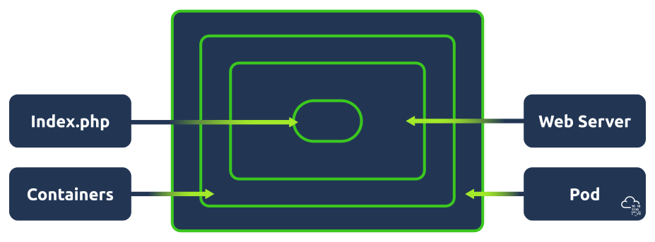
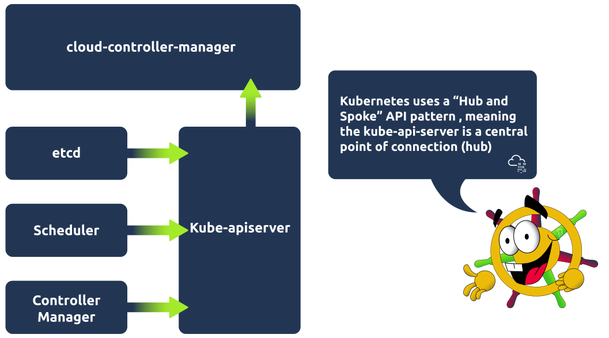
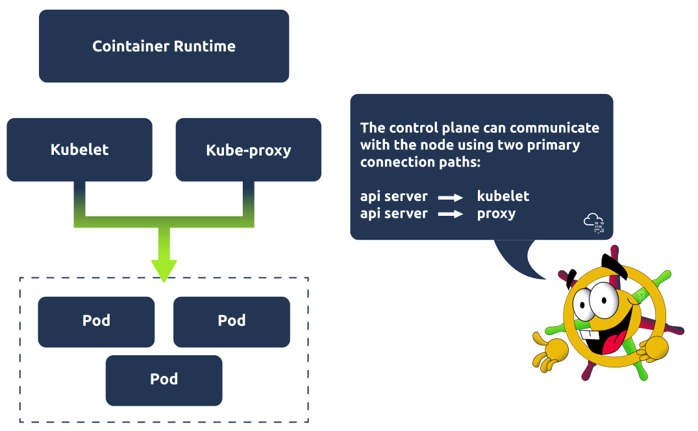
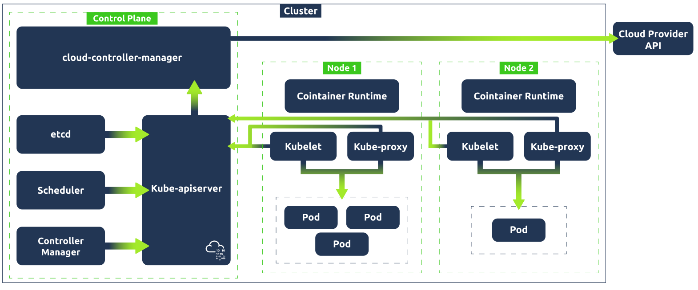

# Table of Contents
- [Table of Contents](#table-of-contents)
  - [Kubernetes Architecture](#kubernetes-architecture)
    - [Cluster Architecture](#cluster-architecture)
    - [The Kubernetes Control Plane](#the-kubernetes-control-plane)
    - [Kubernetes Worker Node](#kubernetes-worker-node)
    - [Communication Between Components](#communication-between-components)
  - [Configuration](#configuration)
    - [Required Fields](#required-fields)
    - [Configuring Resources](#configuring-resources)
  - [References](#references)

## Kubernetes Architecture

### Cluster Architecture 

**Kubernetes Pod**

Pods are the smallest deployable unit of computing you can create and manage in Kubernetes. When you work in DevSecOps with Kubernetes, you'll hear a lot of this word. You can think of a pod as a group of one or more containers. These containers share storage and network resources. Because of this, containers on the same pod can communicate easily as if they were on the same machine whilst maintaining a degree of isolation. Pods are treated as a unit of replication in Kubernetes; if a workload needs to be scaled up, you will increase the number of pods running.

**Kubernetes Nodes**

Kubernetes workloads (applications) are run inside containers, which are placed in a pod. These pods run on nodes. When talking about node architecture, there are two types to consider. The **control plane** (also known as "master node") and **worker nodes**. Both of these have their own architecture/components. Nodes can either be a virtual or physical machine. Think of it this way: if applications run in containers which are placed in a pod, nodes contain all the services necessary to run pods.

**Kubernetes Cluster**

At the highest level, we have our Kubernetes Cluster; put simply, a Cluster is just a set of nodes. 

### The Kubernetes Control Plane

The control plane manages the worker nodes and pods in the cluster. It does this with the use of various components.

**Kube-apiserver**

The API server is the front end of the control plane and is responsible for exposing the Kubernetes API. The kube-apiserver component is scalable, meaning multiple instances can be created so traffic can be load-balanced.

**Etcd** 

Etcd is a key/value store containing cluster data / the current state of the cluster. It is highly available and consistent. If a change is made in the cluster, for example, another pod is spun up, this will be reflected in the key/value store, etcd. The other control plane components rely on etcd as an information store and query it for information such as available resources.

**Kube-scheduler** 

The kube-scheduler component actively monitors the cluster. Its job is to catch any newly created pods that have yet to be assigned to a node and make sure it gets assigned to one. It makes this decision based on specific criteria, such as the resources used by the running application or available resources on all worker nodes

**Kube-controller-manager** 

This component is responsible for running the controller processes. There are many different types of controller processes, but one example of a controller process is the **node controller** process, which is responsible for noticing when nodes go down. The controller manager would then talk to the scheduler component to schedule a new node to come up.

**Cloud-controller-manager** 

This component enables communication between a Kubernetes cluster and a cloud provider API. The purpose of this component is to allow the separation of components that communicate internally within the cluster and those that communicate externally by interacting with a cloud provider. This also allows cloud providers to release features at their own pace.

### Kubernetes Worker Node

Worker nodes are responsible for maintaining running pods. Let's take a look at the components, which are present on every worker node, and what they are responsible for:  

**Kubelet** 

Kubelet is an agent that runs on every node in the cluster and is responsible for ensuring containers are running in a pod. Kubelet is provided with pod specifications and ensures the containers detailed in this pod specification are running and healthy! It executes actions given to it by the controller manager, for example, starting the pod with a container inside.

**Kube-proxy** 

Kube-proxy is responsible for network communication within the cluster. It makes networking rules so traffic can flow and be directed to a pod (from inside or outside of the cluster). Traffic won't hit a pod directly but instead hit something called a Service (which would be associated with a group of pods), and then gets directed to one of the associated pods. More on services in the next task!

**Container runtime**

Pods have containers running inside of them. A container runtime must be installed on each node for this to happen. So far, we have covered one example of this in this module, which is probably the most popular choice, Docker. However, some alternatives can be used, such as rkt or runC.

### Communication Between Components

A Kubernetes cluster contains nodes and Kubernetes runs a workload by placing containers into pods that run on these nodes. Take a look at the graphic below to see how all these components come together.

## Configuration

Kubernetes config files are typically written in YAML. They can also be made interchangeably using the JSON format, but as per the Kubernetes documentation, it is generally considered best practice to use YAML given its easy, human-readable nature (just gotta keep an eye on that indentation!).

### Required Fields

**apiVersion**: The version of the Kubernetes API you are going to use to create this object. The API version you use will depend on the object being defined.

**kind**: What kind of object you are going to create (e.g. Deployment, Service, StatefulSet).

**metadata**: This will contain data that can be used to uniquely identify the object (including name and an optional namespace).

**spec**: The desired state of the object (for deployment, this might be 3 nginx pods).

### Configuring Resources 

## References
 - https://tryhackme.com/room/introtok8s