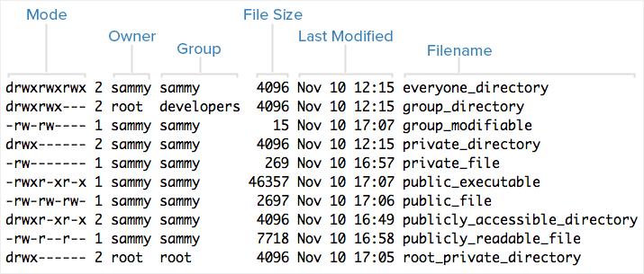
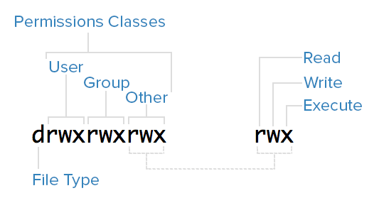
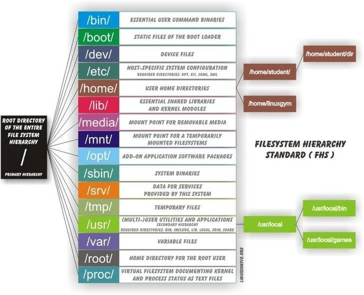

# Table of Contents
- [Table of Contents](#table-of-contents)
  - [Interacting With the Filesystem](#interacting-with-the-filesystem)
    - [Basic commands](#basic-commands)
    - [Searching for Files](#searching-for-files)
  - [Shell Operators](#shell-operators)
  - [Permissions](#permissions)
    - [Users](#users)
    - [Superuser](#superuser)
    - [Groups](#groups)
    - [Ownership and Permissions](#ownership-and-permissions)
  - [Directory Structure](#directory-structure)
  - [References](#references)

## Interacting With the Filesystem

### Basic commands

| Command | Full Name                       | Purpose                                 |
| ------- | ------------------------------- | --------------------------------------- |
| ls      | listing                         | List directory contents                 |
| cd      | change directory                | Change current working directory        |
| cat     | concatenate                     | View or concatenate file contents       |
| pwd     | print working directory         | Show current working directory path     |
| touch   | touch                           | Create an empty file                    |
| mkdir   | make directory                  | Create a new folder                     |
| cp      | copy                            | Copy a file or folder                   |
| mv      | move                            | Move or rename a file or folder         |
| rm      | remove                          | Remove a file or folder                 |
| file    | file                            | Determine the type of a file            |
| man     | manual                          | Show the manual page for a command      |
| echo    | echo                            | Print text or variables to the terminal |
| grep    | global regular expression print | Search text using patterns              |
| head    | head                            | Show the first lines of a file          |
| tail    | tail                            | Show the last lines of a file           |
| less    | less                            | View file contents one page at a time   |
| find    | find                            | Search for files and directories        |
| which   | which                           | Show the full path of a command         |
| history | history                         | Display command history                 |
| clear   | clear                           | Clear the terminal screen               |


### Searching for Files

```shell
tryhackme@linux1:~$ find -name *.txt
./folder1/passwords.txt
./Documents/todo.txt
tryhackme@linux1:~$
```

```shell
tryhackme@linux1:~$ grep "81.143.211.90" access.log
81.143.211.90 - - [25/Mar/2021:11:17 + 0000] "GET / HTTP/1.1" 200 417 "-" "Mozilla/5.0 (Linux; Android 7.0; Moto G(4))"
tryhackme@linux1:~$
```

## Shell Operators

| Symbol / Operator | Description                                                                                                                                      |
| ----------------- | ------------------------------------------------------------------------------------------------------------------------------------------------ |
| &                 | This operator allows you to run commands in the background of your terminal.                                                                     |
| &&                | This operator allows you to combine multiple commands together in one line of your terminal.                                                     |
| >                 | This operator is a redirector - meaning that we can take the output from a command (such as using cat to output a file) and direct it elsewhere. |
| >>                | This operator does the same function of the > operator but appends the output rather than replacing (meaning nothing is overwritten).            |

## Permissions

### Users

In Linux, there are two types of users: **system users** and **regular users**. Traditionally, system users are used to run non-interactive or background processes on a system, while regular users are used for logging in and running processes interactively. When you first initialize and log in to a Linux system, you may notice that it starts out with many system users already created to run the services that the OS depends on. This is normal.

You can view all of the users on a system by looking at the contents of the `/etc/passwd` file. Each line in this file contains information about a single user, starting with its username (the name before the first `:`). You can print the contents of the `passwd` file with `cat`:

```shell
$ cat /etc/passwd

sshd:x:109:65534::/run/sshd:/usr/sbin/nologin
landscape:x:110:115::/var/lib/landscape:/usr/sbin/nologin
pollinate:x:111:1::/var/cache/pollinate:/bin/false
systemd-coredump:x:999:999:systemd Core Dumper:/:/usr/sbin/nologin
lxd:x:998:100::/var/snap/lxd/common/lxd:/bin/false
vault:x:997:997::/home/vault:/bin/bash
stunnel4:x:112:119::/var/run/stunnel4:/usr/sbin/nologin
sammy:x:1001:1002::/home/sammy:/bin/sh
```

### Superuser

In addition to the two user types, there is the **superuser**, or root user, that has the ability to override any file ownership and permission restrictions. In practice, this means that the superuser has the rights to access anything on its own server. This user is used to make system-wide changes.

It is also possible to configure other user accounts with the ability to assume "superuser rights". This is often referred to as having `sudo`, because users who have permissions to temporarily gain superuser rights do so by preceding admin-level commands with `sudo`.

### Groups

Groups are collections of zero or more users. A user belongs to a default group, and can also be a member of any of the other groups on a server.

You can view all the groups on the system and their members by looking in the `/etc/group` file, as you would with `/etc/passwd` for users.

### Ownership and Permissions

In Linux, every file is owned by a single user and a single group, and has its own access permissions. Let's look at how to view the ownership and permissions of a file.

The most common way to view the permissions of a file is to use `ls` with the long listing option `-l`, e.g. `ls -l myfile`.

```shell
$ ls -l
```



Here is a breakdown of the mode metadata of the first file in the above example:



**File Type**

In Linux, there are two types of files: **normal** and **special**. The file type is indicated by the first character of the mode of a file — in this guide, this will be referred to as the “file type field”.

Normal files can be identified by a hyphen (`-`) in their file type fields. Normal files can contain data or anything else. They are called normal, or regular, files to distinguish them from special files.

Special files can be identified by a non-hyphen character, such as a letter, in their file type fields, and are handled by the OS differently than normal files. The character that appears in the file type field indicates the kind of special file a particular file is. For example, a directory, which is the most common kind of special file, is identified by the `d` character that appears in its file type field.

**Permissions Classes**

From the diagram, you can see that the mode column indicates the file type, followed by three triads, or classes, of permissions: user (owner), group, and other. The order of the classes is consistent across all Linux systems.

The three permissions classes work as follows:

- **User**: The owner of a file belongs to this class.
- **Group**: The members of the file's group belong to this class. Group permissions are a useful way of assigning - permissions on a given file to multiple users.
- **Other**: Any users that are not part of the user or group classes for this file belong to this class.

In each triad, read, write, and execute permissions are represented in the following way:

- **Read**: Indicated by an `r` in the first position
- **Write**: Indicated by a `w` in the second position
- **Execute**: Indicated by an `x` in the third position.

A hyphen (`-`) in the place of one of these characters indicates that the respective permission is not available for the respective class. For example, if the group (second) triad for a file is r--, the file is “read-only” to the group that is associated with the file.

## Directory Structure



- **/ – The root directory**

Everything, all the files and directories, in Linux are located under 'root' represented by '/'. If you look at the directory structure, you'll realize that it is similar to a plant's root.

- **/bin – Binaries**

The '/bin' directly contains the executable files of many basic shell commands like ls, cp, cd etc.

- **/dev – Device files**

This directory only contains special files, including those relating to the devices. These are virtual files, not physically on the disk.

Some interesting examples of these files are:

  1. /dev/null: can be sent to destroy any file or string
  1. /dev/zero: contains an infinite sequence of 0
  1. /dev/random: contains an infinite sequence of random values

- **/etc – Configuration files**

The /etc directory contains the core configuration files of the system, use primarily by the administrator and services, such as the password file and networking files.

If you need to make changes in system configuration (for example, changing the hostname), the etc folder is where you'll find the respective files.


- **/usr – User binaries and program data**
in '/usr' go all the executable files, libraries, source of most of the system programs. For this reason, most of the files contained therein is read­only (for the normal user)

  1. '/usr/bin' contains basic user commands
  1. '/usr/sbin' contains additional commands for the administrator
  1. '/usr/lib' contains the system libraries
  1. '/usr/share' contains documentation or common to all libraries, for example '/usr/share/man' contains the text of the manpage

- **/home – User personal data**

Home directory contains personal directories for the users. The home directory contains the user data and user-specific configuration files. As a user, you'll put your personal files, notes, programs etc in your home directory.

- **/lib – Shared libraries**

Libraries are basically codes that can be used by the executable binaries. The /lib directory holds the libraries needed by the binaries in /bin and /sbin directories.

Libraries needed by the binaries in the /usr/bin and /usr/sbin are located in the directory /usr/lib.

- **/sbin – System binaries**
This is similar to the /bin directory. The only difference is that is contains the binaries that can only be run by root or a sudo user. You can think of the ‘s' in ‘sbin' as super or sudo.

- **/tmp – Temporary files**

As the name suggests, this directory holds temporary files. Many applications use this directory to store temporary files. Even you can use directory to store temporary files.

But do note that the contains of the /tmp directories are deleted when your system restarts. Some Linux system also delete files old files automatically so don' store anything important here.

- **/var – Variable data files**

Var, short for variable, is where programs store runtime information like system logging, user tracking, caches, and other files that system programs create and manage.

- **/boot – Boot files**

The '/boot' directory contains the files of the kernel and boot image, in addition to LILO and Grub. It is often advisable that the directory resides in a partition at the beginning of the disc.

- **/proc – Process and kernel files**

The '/proc' directory contains the information about currently running processes and kernel parameters. The content of the proc directory is used by a number of tools to get runtime system information.

- **/opt – Optional software**

Traditionally, the /opt directory is used for installing/storing the files of third-party applications that are not available from the distribution's repository.

The normal practice is to keep the software code in opt and then link the binary file in the /bin directory so that all the users can run it.

- **/root – The home directory of the root**

There is /root directory as well and it works as the home directory of the root user. So instead of /home/root, the home of root is located at /root. Do not confuse it with the root directory (/).

- **/media – Mount point for removable media**

When you connect a removable media such as USB disk, SD card or DVD, a directory is automatically created under the /media directory for them. You can access the content of the removable media from this directory.

- **/mnt – Mount directory**

This is similar to the /media directory but instead of automatically mounting the removable media, mnt is used by system administrators to manually mount a filesystem.

- **/srv – Service data**

The /srv directory contains data for services provided by the system. For example, if you run a HTTP server, it's a good practice to store the website data in the /srv directory.

--- 

## References
 - https://tryhackme.com/room/linuxfundamentalspart1
 - https://tryhackme.com/room/linuxfundamentalspart2
 - https://tryhackme.com/room/linuxfundamentalspart3
 - https://linuxhandbook.com/linux-file-permissions/
 - https://linuxhandbook.com/linux-directory-structure/
 - https://www.digitalocean.com/community/tutorials/process-management-in-linux