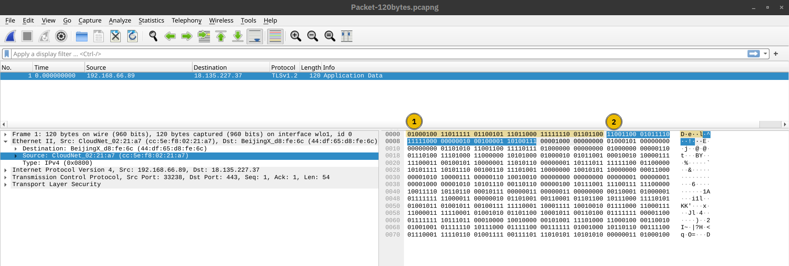
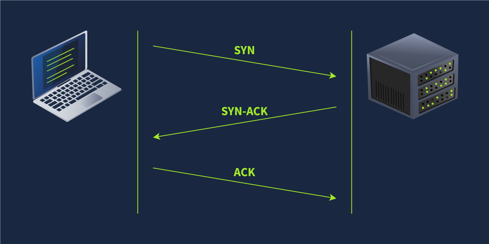
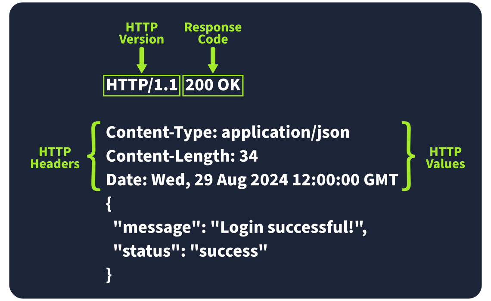
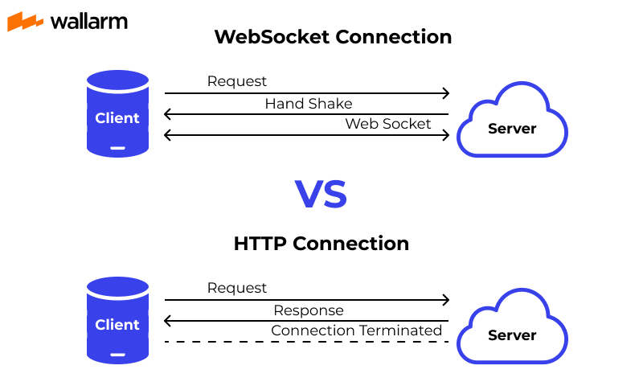

# Table of Contents
- [Table of Contents](#table-of-contents)
  - [Network Models](#network-models)
    - [OSI Model](#osi-model)
      - [Layer 1: Physical Layer](#layer-1-physical-layer)
      - [Layer 2: Data Link Layer](#layer-2-data-link-layer)
      - [Layer 3: Network Layer](#layer-3-network-layer)
      - [Layer 4: Transport Layer](#layer-4-transport-layer)
      - [Layer 5: Session Layer](#layer-5-session-layer)
      - [Layer 6: Presentation Layer](#layer-6-presentation-layer)
      - [Layer 7: Application Layer](#layer-7-application-layer)
    - [TCP/IP Model](#tcpip-model)
  - [IP Networking](#ip-networking)
    - [IP Addresses](#ip-addresses)
    - [ARP](#arp)
    - [ICMP](#icmp)
    - [Routing](#routing)
    - [NAT](#nat)
    - [DHCP](#dhcp)
  - [Transport Layer](#transport-layer)
    - [UDP](#udp)
    - [TCP](#tcp)
    - [DNS](#dns)
  - [Application Protocols](#application-protocols)
    - [Web Protocols](#web-protocols)
      - [URL](#url)
      - [HTTP](#http)
      - [HTTP Cache](#http-cache)
      - [HTTPS](#https)
      - [WebSockets](#websockets)
      - [gRPC](#grpc)
      - [TLS](#tls)
    - [File Protocols](#file-protocols)
      - [SMB](#smb)
      - [NFS](#nfs)
      - [FTP](#ftp)
    - [Email Protocols](#email-protocols)
      - [SMTP](#smtp)
      - [POP3](#pop3)
      - [IMAP](#imap)
    - [Security \& Tunneling](#security--tunneling)
      - [SSH](#ssh)
      - [VPN](#vpn)
  - [References](#references)

## Network Models

### OSI Model

The OSI (Open Systems Interconnection) model is a conceptual model developed by the International Organization for Standardization (ISO) that describes how communications should occur in a computer network. In other words, the OSI model defines a framework for computer network communications. Although this model is theoretical, it is vital to learn and understand as it helps grasp networking concepts on a deeper level. The OSI model is composed of seven layers:

1. Physical Layer
1. Data Link Layer
1. Network Layer
1. Transport Layer
1. Session Layer
1. Presentation Layer
1. Application Layer

The numbering starts with the physical layer being layer 1, while the top layer, the application layer, is layer 7. To help you remember the layers from bottom to top, you can use a mnemonic such as **"Please Do Not Throw Spinach Pizza Away."** You can check the Internet for other easy-to-remember acronyms if this helps you memorise them.

<p align="center">
     
</p>

#### Layer 1: Physical Layer
The physical layer, also referred to as layer 1, deals with the physical connection between devices; this includes the medium, such as a wire, and the definition of the binary digits 0 and 1. Data transmission can be via an electrical, optical, or wireless signal. Consequently, we need data cables or antennas, depending on our physical medium.

In addition to Ethernet cable, shown in the illustration below, and optical fibre cable, examples of the physical layer medium include the WiFi radio bands, the 2.4 GHz band, the 5 GHz band, and the 6 GHz band.

<p align="center">
     
</p>

#### Layer 2: Data Link Layer
The physical layer defines a medium to transmit our signal. The data link layer, i.e., layer 2, represents the protocol that enables data transfer between nodes on the same network segment. Let’s put it in simpler terms. The data link layer describes an agreement between the different systems on the same network segment on how to communicate. A network segment refers to a group of networked devices using a shared medium or channel for information transfer. For example, consider a company office with ten computers connected to a network switch; that’s a network segment.

Examples of layer 2 include Ethernet, i.e., 802.3, and WiFi, i.e., 802.11. Ethernet and WiFi addresses are six bytes. Their address is called a MAC address, where MAC stands for Media Access Control. They are usually expressed in hexadecimal format with a colon separating each two hexadecimal digits (one byte). The three leftmost bytes identify the vendor.

<p align="center">
     
</p>

We expect to see two MAC addresses in each frame in real network communication over Ethernet or WiFi. The packet in the screenshot below shows:

- The destination data-link address (MAC address) highlighted in yellow
- The source data link address (MAC address) is highlighted in blue
- The remaining bits show the data being sent

<p align="center">
     
</p>

#### Layer 3: Network Layer

The data link layer focuses on sending data between two nodes on the same network segment. The network layer, i.e., layer 3, is concerned with sending data between different networks. In more technical terms, the network layer handles logical addressing and routing, i.e., finding a path to transfer the network packets between the diverse networks.

In the data link layer, we gave an example of one company office with ten computers, where the data link layer is responsible for providing a connection between them. Let’s say that this company has multiple offices distributed across various cities, countries, or even continents. The network layer is responsible for connecting the different offices together.

The network below shows that computers A and B are connected, although on different networks. You can also notice two paths connecting the two computers; the network layer will route the network packets through the path it deems better.

<p align="center">
     
</p>

Examples of the network layer include Internet Protocol (IP), Internet Control Message Protocol (ICMP), and Virtual Private Network (VPN) protocols such as IPSec and SSL/TLS VPN.

#### Layer 4: Transport Layer

Layer 4, the transport layer, enables end-to-end communication between running applications on different hosts. Your web browser is connected to the TryHackMe web server over the transport layer, which can support various functions like flow control, segmentation, and error correction.

Examples of layer 4 are Transmission Control Protocol (TCP) and User Datagram Protocol (UDP).

#### Layer 5: Session Layer
The session layer is responsible for establishing, maintaining, and synchronising communication between applications running on different hosts. Establishing a session means initiating communication between applications and negotiating the necessary parameters for the session. Data synchronisation ensures that data is transmitted in the correct order and provides mechanisms for recovery in case of transmission failures.

Examples of the session layer are Network File System (NFS) and Remote Procedure Call (RPC).

#### Layer 6: Presentation Layer
The presentation layer ensures the data is delivered in a form the application layer can understand. Layer 6 handles data encoding, compression, and encryption. An example of encoding is character encoding, such as ASCII or Unicode.

Various standards are used at the presentation layer. Consider the scenario where we want to send an image via email. First, we use JPEG, GIF, and PNG to save our images; furthermore, although hidden from the user by the email client, we use MIME (Multipurpose Internet Mail Extensions) to attach the file to our email. MIME encodes a binary file using 7-bit ASCII characters.

#### Layer 7: Application Layer
The application layer provides network services directly to end-user applications. Your web browser would use the HTTP protocol to request a file, submit a form, or upload a file.

The application layer is the top layer, and you might have encountered many of its protocols as you use different applications. Examples of Layer 7 protocols are HTTP, FTP, DNS, POP3, SMTP, and IMAP.

**Summary:**

Reading about the ISO OSI model for the first time can be intimidating; however, it becomes easier as you progress in your study of networking protocols. We have summarised the ISO OSI layers in the table below.

| Layer Number | Layer Name         | Main Function                                         | Example Protocols and Standards           |
| ------------ | ------------------ | ----------------------------------------------------- | ----------------------------------------- |
| Layer 7      | Application layer  | Providing services and interfaces to applications     | HTTP, FTP, DNS, POP3, SMTP, IMAP          |
| Layer 6      | Presentation layer | Data encoding, encryption, and compression            | Unicode, MIME, JPEG, PNG, MPEG            |
| Layer 5      | Session layer      | Establishing, maintaining, and synchronising sessions | NFS, RPC                                  |
| Layer 4      | Transport layer    | End-to-end communication and data segmentation        | UDP, TCP                                  |
| Layer 3      | Network layer      | Logical addressing and routing between networks       | IP, ICMP, IPSec                           |
| Layer 2      | Data link layer    | Reliable data transfer between adjacent nodes         | Ethernet (802.3), WiFi (802.11)           |
| Layer 1      | Physical layer     | Physical data transmission media                      | Electrical, optical, and wireless signals |

### TCP/IP Model

Now that we have covered the conceptual ISO OSI model, it is time to study an implemented model, the TCP/IP model. TCP/IP stands for Transmission Control Protocol/Internet Protocol and was developed in the 1970s by the Department of Defense (DoD). I hear you ask why DoD would create such a model. One of the strengths of this model is that it allows a network to continue to function as parts of it are out of service, for instance, due to a military attack. This capability is possible in part due to the design of the routing protocols to adapt as the network topology changes.

In our presentation of the ISO OSI model, we went from bottom to top, from layer 1 to layer 7. Let’s look at things from a different perspective, from top to bottom. From top to bottom, we have:

- **Application Layer**: The OSI model application, presentation and session layers, i.e., layers 5, 6, and 7, are grouped into the application layer in the TCP/IP model.
- **Transport Layer**: This is layer 4.
- **Internet Layer**: This is layer 3. The OSI model’s network layer is called the Internet layer in the TCP/IP model.
- **Link Layer**: This is layer 2.

The table below shows how the TCP/IP model layers map to the ISO/OSI model layers.

| Layer Number | ISO OSI Model      | TCP/IP Model (RFC 1122) | Protocols                                       |
| ------------ | ------------------ | ----------------------- | ----------------------------------------------- |
| 7            | Application Layer  | Application Layer       | HTTP, HTTPS, FTP, POP3, SMTP, IMAP, Telnet, SSH |
| 6            | Presentation Layer |                         |                                                 |
| 5            | Session Layer      |                         |                                                 |
| 4            | Transport Layer    | Transport Layer         | TCP, UDP                                        |
| 3            | Network Layer      | Internet Layer          | IP, ICMP, IPSec                                 |
| 2            | Data Link Layer    | Link Layer              | Ethernet 802.3, WiFi 802.11                     |
| 1            | Physical Layer     |                         |

Many modern networking textbooks show the TCP/IP model as five layers instead of four. For example, in Computer Networking: A Top-Down Approach 8th Edition, Kurose and Ross describe the following five-layer Internet protocol stack by including the physical layer:

- Application
- Transport
- Network
- Link
- Physical

<p align="center">
     
</p>

## IP Networking

### IP Addresses

When you hear the word IP address, you might think of an address like `192.168.0.1` or something less common, such as `172.16.159.243`. In both cases, you are right. Both of these are IP addresses; IPv4 (IP version 4) addresses to be specific.

Every host on the network needs a unique identifier for other hosts to communicate with him. Without a unique identifier, the host cannot be found without ambiguity. When using the TCP/IP protocol suite, we need to assign an IP address for each device connected to the network.

One analogy of an IP address is your home postal address. Your postal address allows you to receive letters and parcels from all over the world. Furthermore, it can identify your home without ambiguity; otherwise, you cannot shop online!

As you might already know, we have IPv4 and IPv6 (IP version 6). IPv4 is still the most common, and whenever you come across a text mentioning IP without the version, we expect them to mean IPv4.

So, what makes an IP address? An IP address comprises four octets, i.e., 32 bits. Being 8 bits, an octet allows us to represent a decimal number between 0 and 255. An IP address is shown in the image below.

<p align="center">
     
</p>

At the risk of oversimplifying things, the 0 and 255 are reserved for the network and broadcast addresses, respectively. In other words, `192.168.1.0` is the network address, while `192.168.1.255` is the broadcast address. Sending to the broadcast address targets all the hosts on the network. With simple math, you can conclude that we cannot have more than 4 billion unique IPv4 addresses. If you are curious about the math, it is approximately 232 because we have 32 bits. This number is approximate because we didn’t consider network and broadcast addresses.

**Looking Up Your Network Configuration:**

You can look up your IP address on the MS Windows command line using the command `ipconfig`. On Linux and UNIX-based systems, you can issue the command `ifconfig` or `ip address show`, which can be typed as `ip a s`. In the terminal window below, we show `ifconfig`.

```shell
user@TryHackMe$ ifconfig
[...]
wlo1: flags=4163<UP,BROADCAST,RUNNING,MULTICAST>  mtu 1500
        inet 192.168.66.89  netmask 255.255.255.0  broadcast 192.168.66.255
        inet6 fe80::73e1:ca5e:3f93:b1b3  prefixlen 64  scopeid 0x20<link>
        ether cc:5e:f8:02:21:a7  txqueuelen 1000  (Ethernet)
        RX packets 19684680  bytes 18865072842 (17.5 GiB)
        RX errors 0  dropped 364  overruns 0  frame 0
        TX packets 14439678  bytes 8773200951 (8.1 GiB)
        TX errors 0  dropped 0 overruns 0  carrier 0  collisions 0
```

The terminal output above indicates the following:

- The host (laptop) IP address is `192.168.66.89`
- The subnet mask is `255.255.255.0`
- The broadcast address is `192.168.66.255`

Let’s use `ip a s` to compare how the network card IP address is presented.


```shell
user@TryHackMe$ ip a s
[...]
4: wlo1: <BROADCAST,MULTICAST,UP,LOWER_UP> mtu 1500 qdisc noqueue state UP group default qlen 1000
    link/ether cc:5e:f8:02:21:a7 brd ff:ff:ff:ff:ff:ff
    altname wlp3s0
    inet 192.168.66.89/24 brd 192.168.66.255 scope global dynamic noprefixroute wlo1
       valid_lft 36795sec preferred_lft 36795sec
    inet6 fe80::73e1:ca5e:3f93:b1b3/64 scope link noprefixroute 
       valid_lft forever preferred_lft forever
```

The terminal output above indicates the following:

- The host (laptop) IP address is `192.168.66.89/24`
- The broadcast address is `192.168.66.255`

If you are wondering, a subnet mask of `255.255.255.0` can also be written as `/24`. The `/24` means that the leftmost 24 bits within the IP address do not change across the network, i.e., the subnet. In other words, the leftmost three octets are the same across the whole subnet; therefore, we can expect to find addresses that range from `192.168.66.1` to `192.168.66.254`. Similar to what was mentioned earlier, `192.168.66.0` and `192.168.66.255` are the network and broadcast addresses, respectively.

**Private Addresses:**

As we are explaining IP addresses, it is useful to mention that for most practical purposes, there are two types of IP addresses:

- Public IP addresses
- Private IP addresses

RFC 1918 defines the following three ranges of private IP addresses:

- 10.0.0.0 - 10.255.255.255 (10/8)
- 172.16.0.0 - 172.31.255.255 (172.16/12)
- 192.168.0.0 - 192.168.255.255 (192.168/16)  

We presented earlier an analogy stating that a public IP address is like your home postal address. A private IP address is different; the original idea is that it cannot reach or be reached from the outside world. It is like an isolated city or a compound, where all houses and apartments are numbered systematically and can easily exchange mail with each other, but not with the outside world. For a private IP address to access the Internet, the router must have a public IP address and must support Network Address Translation (NAT). At this stage, let’s not worry about understanding how NAT works, as we will revisit it later in this module.

**Routing:**

A router is like your local post office; you hand them the mail parcel, and they would know how to deliver it. If we dig deeper, you might mail something to an address in another city or country. The post office will check the address and decide where to send it next. For example, if it is to leave the country, we expect one central office to handle all shipments abroad.

In technical terms, a router forwards data packets to the proper network. Usually, a data packet passes through multiple routers before it reaches its final destination. The router functions at layer 3, inspecting the IP address and forwarding the packet to the best network (router) so the packet gets closer to its destination.

<p align="center">
     
</p>

### ARP

We have stated in the Networking Concepts room that as two hosts communicate over a network, an IP packet is encapsulated within a data link frame as it travels over layer 2. Remember that the two common data link layers we use are Ethernet (IEEE 802.3) and WiFi (IEEE 802.11). Whenever one host needs to communicate with another host on the same Ethernet or WiFi, it must send the IP packet within a data link layer frame. Although it knows the IP address of the target host, it needs to look up the target’s MAC address so the proper data link header can be created.

As you would remember, a MAC address is a 48-bit number typically represented in hexadecimal notation; for example, `7C:DF:A1:D3:8C:5C` and `44:DF:65:D8:FE:6C` are two MAC addresses on my network.

However, the devices on the same Ethernet network do not need to know each other’s MAC addresses all the time; they only need to know each other’s MAC addresses while communicating. Everything revolves around IP addresses. Consider this scenario: You connect your device to a network, and if the network has a DHCP server, your device is automatically configured to use a specific gateway (router) and DNS server. Consequently, your device knows the IP address of the DNS server to resolve any domain name; moreover, it knows the IP address of the router when it needs to send packets over the Internet. In all this scenario, no MAC addresses are revealed. However, two devices on the same Ethernet cannot communicate without knowing each other’s MAC addresses.

As a reminder, in the screenshot below, we see an IP packet within an Ethernet frame. The Ethernet frame header contains:

- Destination MAC address
- Source MAC address
- Type (IPv4 in this case)

<p align="center">
     
</p>

Address Resolution Protocol (ARP) makes it possible to find the MAC address of another device on the Ethernet. In the example below, a host with the IP address `192.168.66.89` wants to communicate with another system with the IP address `192.168.66.1`. It sends an ARP Request asking the host with the IP address `192.168.66.1` to respond. The ARP Request is sent from the MAC address of the requester to the broadcast MAC address, `ff:ff:ff:ff:ff:ff` as shown in the first packet. The ARP Reply arrived shortly afterwards, and the host with the IP address `192.168.66.1` responded with its MAC address. From this point, the two hosts can exchange data link layer frames.

```shell
user@TryHackMe$ tshark -r arp.pcapng -Nn
    1 0.000000000 cc:5e:f8:02:21:a7 → ff:ff:ff:ff:ff:ff ARP 42 Who has 192.168.66.1? Tell 192.168.66.89
    2 0.003566632 44:df:65:d8:fe:6c → cc:5e:f8:02:21:a7 ARP 42 192.168.66.1 is at 44:df:65:d8:fe:6c
```

If we use `tcpdump`, the packets will be displayed differently. It uses the terms ARP **Request** and ARP **Reply**. For your information, the output is shown in the terminal below.

```shell
user@TryHackMe$ tcpdump -r arp.pcapng -n -v
17:23:44.506615 ARP, Ethernet (len 6), IPv4 (len 4), Request who-has 192.168.66.1 tell 192.168.66.89, length 28
17:23:44.510182 ARP, Ethernet (len 6), IPv4 (len 4), Reply 192.168.66.1 is-at 44:df:65:d8:fe:6c, length 28
```

An ARP Request or ARP Reply is not encapsulated within a UDP or even IP packet; it is encapsulated directly within an Ethernet frame. The following ARP Reply shows this.

<p align="center">
     
</p>


ARP is considered layer 2 because it deals with MAC addresses. Others would argue that it is part of layer 3 because it supports IP operations. What is essential to know is that ARP allows the translation from layer 3 addressing to layer 2 addressing

### ICMP

Internet Control Message Protocol (ICMP) is mainly used for network diagnostics and error reporting. Two popular commands rely on ICMP, and they are instrumental in network troubleshooting and network security. The commands are:

- `ping`: This command uses ICMP to test connectivity to a target system and measures the round-trip time (RTT). In other words, it can be used to learn that the target is alive and that its reply can reach our system.
- `traceroute`: This command is called `traceroute` on Linux and UNIX-like systems and `tracert` on MS Windows systems. It uses ICMP to discover the route from your host to the target.

**Ping:**

You may have never played ping-pong (table tennis) before; however, thanks to ICMP, you can now play it with the computer! The `ping` command sends an ICMP Echo Request (ICMP Type `8`). The screenshot below shows the ICMP message within an IP packet.

<p align="center">
   
</p>

The computer on the receiving end responds with an ICMP Echo Reply (ICMP Type 0).

<p align="center">
   
</p>

Many things might prevent us from getting a reply. In addition to the possibility of the target system being offline or shut down, a firewall along the path might block the necessary packets for `ping` to work. In the example below, we used `-c 4` to tell the `ping` command to stop after sending four packets.

```shell
user@TryHackMe$ ping 192.168.11.1 -c 4
PING 192.168.11.1 (192.168.11.1) 56(84) bytes of data.
64 bytes from 192.168.11.1: icmp_seq=1 ttl=63 time=11.2 ms
64 bytes from 192.168.11.1: icmp_seq=2 ttl=63 time=3.81 ms
64 bytes from 192.168.11.1: icmp_seq=3 ttl=63 time=3.99 ms
64 bytes from 192.168.11.1: icmp_seq=4 ttl=63 time=23.4 ms

--- 192.168.11.1 ping statistics ---
4 packets transmitted, 4 received, 0% packet loss, time 3003ms
rtt min/avg/max/mdev = 3.805/10.596/23.366/7.956 ms
```

The output shows no packet loss; moreover, it calculates the minimum, average, maximum, and standard deviation (mdev) of the round-trip time (RTT).

**Traceroute:**

How can we make every router between our system and a target system reveal itself?

The Internet protocol has a field called Time-to-Live (TTL) that indicates the maximum number of routers a packet can travel through before it is dropped. The router decrements the packet’s TTL by one before it sends it across. When the TTL reaches zero, the router drops the packet and sends an ICMP Time Exceeded message (ICMP Type `11`). (In this context, “time” is measured in the number of routers, not seconds.)

The terminal output below shows the result of running `traceroute` to discover the routers between our system and `example.com`. Some routers don’t respond; in other words, they drop the packet without sending any ICMP messages. Routers that belong to our ISP might respond, revealing their private IP address. Moreover, some routers respond and show their public IP address, and this would let us look up their domain name and discover their geographic location. Finally, there is always a possibility that an ICMP Time Exceeded message gets blocked and never reaches us.

```shell
user@TryHackMe$ traceroute example.com
traceroute to example.com (93.184.215.14), 30 hops max, 60 byte packets
 1  _gateway (192.168.66.1)  4.414 ms  4.342 ms  4.320 ms
 2  192.168.11.1 (192.168.11.1)  5.849 ms  5.830 ms  5.811 ms
 3  100.104.0.1 (100.104.0.1)  11.130 ms  11.111 ms  11.093 ms
 4  10.149.1.45 (10.149.1.45)  6.156 ms  6.138 ms  6.120 ms
 5  * * *
 6  * * *
 7  * * *
 8  172.16.48.1 (172.16.48.1)  5.667 ms  8.165 ms  6.861 ms
 9  ae81.edge4.Marseille1.Level3.net (212.73.201.45)  50.811 ms  52.857 ms 213.242.116.233 (213.242.116.233)  52.798 ms
10  NTT-level3-Marseille1.Level3.net (4.68.68.150)  93.351 ms  79.897 ms  79.804 ms
11  ae-9.r20.parsfr04.fr.bb.gin.ntt.net (129.250.3.38)  62.935 ms  62.908 ms  64.313 ms
12  ae-14.r21.nwrknj03.us.bb.gin.ntt.net (129.250.4.194)  141.816 ms  141.782 ms  141.757 ms
13  ae-1.a02.nycmny17.us.bb.gin.ntt.net (129.250.3.17)  145.786 ms ae-1.a03.nycmny17.us.bb.gin.ntt.net (129.250.3.128)  141.701 ms  147.586 ms
14  ce-0-3-0.a02.nycmny17.us.ce.gin.ntt.net (128.241.1.14)  148.692 ms ce-3-3-0.a03.nycmny17.us.ce.gin.ntt.net (128.241.1.90)  141.615 ms ce-0-3-0.a02.nycmny17.us.ce.gin.ntt.net (128.241.1.14)  148.168 ms
15  ae-66.core1.nyd.edgecastcdn.net (152.195.69.133)  141.100 ms ae-65.core1.nyd.edgecastcdn.net (152.195.68.133)  140.360 ms ae-66.core1.nyd.edgecastcdn.net (152.195.69.133)  140.638 ms
16  93.184.215.14 (93.184.215.14)  140.574 ms  140.543 ms  140.514 ms
17  93.184.215.14 (93.184.215.14)  140.488 ms  139.397 ms  141.854 ms
```

The traversed route might change as we rerun the command.

### Routing

Consider the network diagram shown below. It only has three networks; however, how can the Internet figure out how to deliver a packet from Network 1 to Network 2 or Network 3? Although this is an overly simplified diagram, we need some algorithm to figure out how to connect Network 1 to Network 2 and Network 3 and vice versa.

<p align="center">
   
</p>

Let’s consider a more detailed diagram. The Internet would be millions of routers and billions of devices. The network below is a tiny subset of the Internet. The mobile user can reach the web server; however, for this to happen, each router across the path needs to send the packets via the appropriate link. Obviously, there is more than one path, i.e., route, connecting the mobile user and the web server. We need a routing algorithm for the router to figure out which link to use.

<p align="center">
   
</p>

We will briefly describe a few routing protocols so that you become familiar with their names:

- **OSPF (Open Shortest Path First)**: OSPF is a routing protocol that allows routers to share information about the network topology and calculate the most efficient paths for data transmission. It does this by having routers exchange updates about the state of their connected links and networks. This way, each router has a complete map of the network and can determine the best routes to reach any destination.
- **EIGRP (Enhanced Interior Gateway Routing Protocol)**: EIGRP is a Cisco proprietary routing protocol that combines aspects of different routing algorithms. It allows routers to share information about the networks they can reach and the cost (like bandwidth or delay) associated with those routes. Routers then use this information to choose the most efficient paths for data transmission.
- **BGP (Border Gateway Protocol)**: BGP is the primary routing protocol used on the Internet. It allows different networks (like those of Internet Service Providers) to exchange routing information and establish paths for data to travel between these networks. BGP helps ensure data can be routed efficiently across the Internet, even when traversing multiple networks.
- **RIP (Routing Information Protocol)**: RIP is a simple routing protocol often used in small networks. Routers running RIP share information about the networks they can reach and the number of hops (routers) required to get there. As a result, each router builds a routing table based on this information, choosing the routes with the fewest hops to reach each destination.

### NAT

IPv4 can support a maximum of four billion devices. With the increase in the number of devices connected to the Internet, from computers and smartphones to security cameras and washing machines, it was clear that the IPv4 address space would be depleted quickly. One solution to address depletion is Network Address Translation (NAT).

The idea behind NAT lies in using **one public IP address** to provide Internet access to **many private IP addresses**. In other words, if you are connecting a company with twenty computers, you can provide Internet access to all twenty computers by using a single public IP address instead of twenty public IP addresses. (Note: *Technically speaking, the number of IP addresses is always expressed as a power of two. To be technically accurate, with NAT, you reserve two public IP addresses instead of thirty-two. Consequently, you would have saved thirty public IP addresses*.)

Unlike routing, which is the natural way to route packets to the destination host, routers that support NAT must find a way to track ongoing connections. Consequently, NAT-supporting routers maintain a table translating network addresses between internal and external networks. Generally, the internal network would use a private IP address range, while the external network would use a public IP address.

In the diagram below, multiple devices access the Internet via a router that supports NAT. The router maintains a table that maps the internal IP address and port number with its external IP address and port number. For instance, the laptop might establish a connection with some web server. From the laptop perspective, the connection is initiated from its IP address `192.168.0.129` from TCP source port number `15401`; however, the web server will see this same connection as being established from `212.3.4.5` and TCP port number `19273`, as shown in the translation table. The router does this address translation seamlessly.

<p align="center">
   
</p>

### DHCP

You went to your favourite coffee shop, grabbed your favourite hot drink, and opened your laptop. Your laptop connected to the shop’s WiFi and automatically configured the network, so you could now work on a new TryHackMe room. You didn’t type a single IP address, yet your device is all set up. Let’s see how this happened.

Whenever we want to access a network, at the very least, we need to configure the following:

- IP address along with subnet mask
- Router (or gateway)
- DNS server

Whenever we connect our device to a new network, the above configurations must be set according to the new network. Manually configuring these settings is a good option, especially for servers. Servers are not expected to switch networks; you don’t carry your domain controller and connect it to the coffee shop WiFi. Moreover, other devices need to connect to the servers and expect to find them at specific IP addresses.

Having an automated way to configure connected devices has many advantages. First, it would save us from manually configuring the network; this is extremely important, especially for mobile devices. Secondly, it saves us from address conflicts, i.e., when two devices are configured with the same IP address. An IP address conflict would prevent the involved hosts from using the network resources; this applies to local resources and the Internet. The solution lies in using Dynamic Host Configuration Protocol (DHCP). DHCP is an application-level protocol that relies on UDP; the server listens on UDP port 67, and the client sends from UDP port 68. Your smartphone and laptop are configured to use DHCP by default.

<p align="center">
   
</p>

DHCP follows four steps: Discover, Offer, Request, and Acknowledge (DORA):

- DHCP Discover: The client broadcasts a DHCPDISCOVER message seeking the local DHCP server if one exists.
- DHCP Offer: The server responds with a DHCPOFFER message with an IP address available for the client to accept.
- DHCP Request: The client responds with a DHCPREQUEST message to indicate that it has accepted the offered IP.
- DHCP Acknowledge: The server responds with a DHCPACK message to confirm that the offered IP address is now assigned to this client.

<p align="center">
   
</p>

The following packet capture shows the four steps explained above. In this example, the client gets the address `192.168.66.133`.

```shell
user@TryHackMe$ tshark -r DHCP-G5000.pcap -n
    1   0.000000      0.0.0.0 → 255.255.255.255 DHCP 342 DHCP Discover - Transaction ID 0xfb92d53f
    2   0.013904 192.168.66.1 → 192.168.66.133 DHCP 376 DHCP Offer    - Transaction ID 0xfb92d53f
    3   4.115318      0.0.0.0 → 255.255.255.255 DHCP 342 DHCP Request  - Transaction ID 0xfb92d53f
    4   4.228117 192.168.66.1 → 192.168.66.133 DHCP 376 DHCP ACK      - Transaction ID 0xfb92d53f
```

In the DHCP packet exchange, we can notice the following:

- The client starts without any IP network configuration. It only has a MAC address. In the first and third packets, DHCP Discover and DHCP Request, the client searching for a DHCP server still has no IP network configuration and has not yet used the DHCP server’s offered IP address. Therefore, it sends packets from the IP address `0.0.0.0` to the broadcast IP address `255.255.255.255`.
- As for the link layer, in the first and third packets, the client sends to the broadcast MAC address, `ff:ff:ff:ff:ff:ff` (not shown in the output above). The DHCP server offers an available IP address along with the network configuration in the DHCP offer. It uses the client’s destination MAC address. (It used the proposed IP address in this example system.)

At the end of the DHCP process, our device would have received all the configuration needed to access the network or even the Internet. In particular, we expect that the DHCP server has provided us with the following:

- The leased IP address to access network resources
- The gateway to route our packets outside the local network
- A DNS server to resolve domain names

## Transport Layer

### UDP
The IP protocol allows us to reach a destination host on the network; the host is identified by its IP address. We need protocols that would enable processes on networked hosts to communicate with each other. There are two transport protocols to achieve that: **UDP** and **TCP**.

**UDP** (User Datagram Protocol) allows us to reach a specific process on this target host. UDP is a simple connectionless protocol that operates at the transport layer, i.e., layer 4. Being connectionless means that it does not need to establish a connection. UDP does not even provide a mechanism to know that the packet has been delivered.

An IP address identifies the host; we need a mechanism to determine the sending and receiving process. This can be achieved by using port numbers. A port number uses two octets; consequently, it ranges between 1 and 65535; port 0 is reserved. (The number 65535 is calculated by the expression 216 − 1.)

A real-life example similar to UDP is the standard mail service, with no delivery confirmation. In other words, there is no guarantee that the UDP packet has been received successfully, similar to the case of sending a parcel using standard mail with no confirmation of delivery. In the case of standard mail, it means a cheaper cost than the mail delivery options with confirmation. In the case of UDP, it means better speed than a transport protocol that provides “confirmation.”

But what if we want a transport protocol that acknowledges received packets? The answer lies in using TCP instead of UDP.

### TCP
TCP (Transmission Control Protocol) is a connection-oriented transport protocol. It uses various mechanisms to ensure reliable data delivery sent by the different processes on the networked hosts. Like UDP, it is a layer 4 protocol. Being connection-oriented, it requires the establishment of a TCP connection before any data can be sent.

In TCP, each data octet has a sequence number; this makes it easy for the receiver to identify lost or duplicated packets. The receiver, on the other hand, acknowledges the reception of data with an acknowledgement number specifying the last received octet.

A TCP connection is established using what’s called a three-way handshake. Two flags are used: SYN (Synchronise) and ACK (Acknowledgment). The packets are sent as follows:

- SYN Packet: The client initiates the connection by sending a SYN packet to the server. This packet contains the client’s randomly chosen initial sequence number.
- SYN-ACK Packet: The server responds to the SYN packet with a SYN-ACK packet, which adds the initial sequence number randomly chosen by the server.
- ACK Packet: The three-way handshake is completed as the client sends an ACK packet to acknowledge the reception of the SYN-ACK packet.

<p align="center">
   
</p>

Similar to UDP, TCP identifies the process of initiating or waiting (listening) for a connection using port numbers. As stated, a valid port number ranges between 1 and 65535 because it uses two octets and port 0 is reserved.

**Encapsulation:**

Before wrapping up, it is crucial to explain another key concept: **encapsulation**. In this context, encapsulation refers to the process of every layer adding a header (and sometimes a trailer) to the received unit of data and sending the “encapsulated” unit to the layer below.

Encapsulation is an essential concept as it allows each layer to focus on its intended function. In the image below, we have the following four steps:

- **Application data**: It all starts when the user inputs the data they want to send into the application. For example, you write an email or an instant message and hit the send button. The application formats this data and starts sending it according to the application protocol used, using the layer below it, the transport layer.

- **Transport protocol segment or datagram**: The transport layer, such as TCP or UDP, adds the proper header information and creates the TCP **segment** (or UDP **datagram**). This segment is sent to the layer below it, the network layer.

- **Network packet**: The network layer, i.e. the Internet layer, adds an IP header to the received TCP segment or UDP datagram. Then, this IP **packet** is sent to the layer below it, the data link layer.

- **Data link frame**: The Ethernet or WiFi receives the IP packet and adds the proper header and trailer, creating a **frame**.

We start with application data. At the transport layer, we add a TCP or UDP header to create a **TCP segment** or **UDP datagram**. Again, at the network layer, we add the proper IP header to get an **IP packet** that can be routed over the Internet. Finally, we add the appropriate header and trailer to get a WiFi or Ethernet frame at the link layer.

<p align="center">
   
</p>

The process has to be reversed on the receiving end until the application data is extracted.

**The Life of a Packet:**

Based on what we have studied so far, we can explain a simplified version of the packet’s life. Let’s consider the scenario where you search for a room on TryHackMe.

- On the TryHackMe search page, you enter your search query and hit enter.
- Your web browser, using HTTPS, prepares an HTTP request and pushes it to the layer below it, the transport layer.
- The TCP layer needs to establish a connection via a three-way handshake between your browser and the TryHackMe web server. After establishing the TCP connection, it can send the HTTP request containing the search query. Each TCP segment created is sent to the layer below it, the Internet layer.
- The IP layer adds the source IP address, i.e., your computer, and the destination IP address, i.e., the IP address of the TryHackMe web server. For this packet to reach the router, your laptop delivers it to the layer below it, the link layer.
- Depending on the protocol, The link layer adds the proper link layer header and trailer, and the packet is sent to the router.
- The router removes the link layer header and trailer, inspects the IP destination, among other fields, and routes the packet to the proper link. Each router repeats this process until it reaches the router of the target server.

The steps will then be reversed as the packet reaches the router of the destination network.

### DNS

Do you remember the IP addresses of your favourite websites? Unless it is a private IP address of a local device, no one needs to worry about memorizing IP addresses. This is in part due to the Domain Name System (DNS), which is responsible for properly mapping a domain name to an IP address.

DNS operates at the Application Layer, i.e., Layer 7 of the ISO OSI model. DNS traffic uses UDP port 53 by default and TCP port 53 as a default fallback. There are many types of DNS records; however, we will focus on the following four:

- **A record**: The A (Address) record maps a hostname to one or more IPv4 addresses. For example, you can set `example.com` to resolve to `172.17.2.172`.
- **AAAA Record**: The AAAA record is similar to the A Record, but it is for IPv6. Remember that it is AAAA (quad-A), as AA and AAA would refer to a battery size; furthermore, AAA refers to Authentication, Authorization, and Accounting; neither falls under DNS.
- **CNAME Record**: The CNAME (Canonical Name) record maps a domain name to another domain name. For example, `www.example.com` can be mapped to `example.com` or even to `example.org`.
- **MX Record**: The MX (Mail Exchange) record specifies the mail server responsible for handling emails for a domain.

In other words, when you type `example.com` in your browser, your browser tries to resolve this domain name by querying the DNS server for the A record. However, when you try to send an email to `test@example.com`, the mail server would query the DNS server to find the MX record.

If you want to look up the IP address of a domain from the command line, you can use a tool such as `nslookup`. Consider the example in the terminal below where we look up `example.com`.

```shell
user@TryHackMe$ nslookup www.example.com
Server:         127.0.0.53
Address:        127.0.0.53#53

Non-authoritative answer:
Name:   www.example.com
Address: 93.184.215.14
Name:   www.example.com
Address: 2606:2800:21f:cb07:6820:80da:af6b:8b2c
```

The query above led to four packets. In the terminal below, we can see that the first and third packets send DNS queries for the A and AAAA records, respectively. The second and fourth packets show the DNS query responses.

```shell
user@TryHackMe$ tshark -r dns-query.pcapng -Nn
    1 0.000000000 192.168.66.89 → 192.168.66.1 DNS 86 Standard query 0x2e0f A www.example.com OPT
    2 0.059049584 192.168.66.1 → 192.168.66.89 DNS 102 Standard query response 0x2e0f A www.example.com A 93.184.215.14 OPT
    3 0.059721705 192.168.66.89 → 192.168.66.1 DNS 86 Standard query 0x96e1 AAAA www.example.com OPT
    4 0.101568276 192.168.66.1 → 192.168.66.89 DNS 114 Standard query response 0x96e1 AAAA www.example.com AAAA 2606:2800:21f:cb07:6820:80da:af6b:8b2c OPT
```

## Application Protocols

### Web Protocols

#### URL

A Uniform Resource Locator (URL) is a web address that lets you access all kinds of online content—whether it’s a webpage, a video, a photo, or other media. It guides your browser to the right place on the Internet.

<p align="center">
   
</p>

Think of a URL as being made up of several parts, each playing a different role in helping you find the right resource. Understanding how these parts fit together is important for browsing the web, developing web applications, and even troubleshooting problems.

Here’s a breakdown of the key components:

**Scheme**

The **scheme** is the protocol used to access the website. The most common are **HTTP** (HyperText Transfer Protocol) and **HTTPS** (Hypertext Transfer Protocol Secure). HTTPS is more secure because it encrypts the connection, which is why browsers and cyber security experts recommend it. Websites often enforce HTTPS for added protection.

**User**

Some URLs can include a user’s login details (usually a username) for sites that require authentication. This happens mostly in URLs that need credentials to access certain resources. However, it’s rare nowadays because putting login details in the URL isn’t very safe—it can expose sensitive information, which is a security risk.

**Host/Domain**

The **host** or **domain** is the most important part of the URL because it tells you which website you’re accessing. Every domain name has to be unique and is registered through domain registrars. From a security standpoint, look for domain names that appear almost like real ones but have small differences (this is called **typosquatting**). These fake domains are often used in phishing attacks to trick people into giving up sensitive info.

**Port**

The **port number** helps direct your browser to the right service on the web server. It’s like telling the server which doorway to use for communication. Port numbers range from 1 to 65,535, but the most common are **80** for HTTP and **443** for HTTPS.

**Path**

The **path** points to the specific file or page on the server that you’re trying to access. It’s like a roadmap that shows the browser where to go. Websites need to secure these paths to make sure only authorised users can access sensitive resources.

**Query String**

The **query string** is the part of the URL that starts with a question mark (?). It’s often used for things like search terms or form inputs. Since users can modify these query strings, it’s important to handle them securely to prevent attacks like **injections**, where malicious code could be added.

**Fragment**

The **fragment** starts with a hash symbol (#) and helps point to a specific section of a webpage—like jumping directly to a particular heading or table. Users can modify this too, so like with query strings, it’s important to check and clean up any data here to avoid issues like injection attacks.

#### HTTP

HTTP messages are packets of data exchanged between a user (the client) and the web server. These messages are very important for understanding how web applications work because they show how users' requests and the server's responses are communicated.

Imagine an example of an HTTP Request and an HTTP Response, where you can see key parts like the method, URL, headers, and status codes. These are what make the client-server interaction possible.

There are two types of HTTP messages:
- HTTP Requests: Sent by the user to trigger actions on the web application.
- HTTP Responses: Sent by the server in response to the user’s request.

<p align="center">
   
</p>

Each message follows a specific format that helps both the user and the server communicate smoothly.

**Start Line**

The start line is like the introduction of the message. It tells you what kind of message is being sent—whether it's a request from the user or a response from the server. This line also gives important details about how the message should be handled.

**Headers**

Headers are made up of key-value pairs that provide extra information about the HTTP message. They give instructions to both the client and the server handling the request or response. These headers cover all sorts of things, like security, content types, and more, making sure everything goes smoothly in the communication.

**Empty Line**

The empty line is a little divider that separates the header from the body. It’s essential because it shows where the headers stop and where the actual content of the message begins. Without this empty line, the message might get messed up, and the client or server could misinterpret it, causing errors.

**Body**

The body is where the actual data is stored. In a request, the body might include data the user wants to send to the server (like form data). In a response, it’s where the server puts the content that the user requested (like a webpage or API data).

**Why Understanding HTTP Messages Matters**  
- These messages are the foundation of how web applications communicate. If they’re structured properly, everything works smoothly.
- Knowing how they work will help you diagnose issues in web communication, which means better performance and reliability for your web application.
- It’s also crucial for security. Understanding HTTP messages helps you implement strong security measures to protect data during transmission.

**HTTP Request**

An **HTTP request** is what a user sends to a web server to interact with a web application and make something happen. Since these requests are often the first point of contact between the user and the web server, knowing how they work is super important—especially if you’re into cyber security.

<p align="center">
   
</p>

Imagine an HTTP request showing the key parts like the method (e.g., GET or POST), path (e.g., /login), and version (e.g., HTTP/1.1). These elements make up the basics of how a client (user) communicates with a server.

**Request Line:**

The **request line** (or start line) is the first part of an HTTP request and tells the server what kind of request it’s dealing with. It has three main parts: the **HTTP method**, the **URL path**, and the **HTTP version**.

**Example**: `METHOD /path HTTP/version`

**HTTP Methods:**

The **HTTP method** tells the server what action the user wants to perform on the resource identified by the URL path. Here are some of the most common methods and their possible security issue:

- **GET**
Used to **fetch** data from the server without making any changes. Reminder! Make sure you’re only exposing data the user is allowed to see. Avoid putting sensitive info like tokens or passwords in GET requests since they can show up as plaintext.

- **POST**
**Sends** data to the server, usually to create or update something. Reminder! Always validate and clean the input to avoid attacks like SQL injection or XSS.

- **PUT**
Replaces or **updates** something on the server. Reminder! Make sure the user is authorised to make changes before accepting the request.

- **DELETE**
**Removes** something from the server. Reminder! Just like with PUT, make sure only authorised users can delete resources.

Besides these common methods, there are a few others used in specific cases:

- **PATCH**
Updates part of a resource. It’s useful for making small changes without replacing the whole thing, but always validate the data to avoid inconsistencies.

- **HEAD**
Works like GET but only retrieves headers, not the full content. It’s handy for checking metadata without downloading the full response.

- **OPTIONS**
Tells you what methods are available for a specific resource, helping clients understand what they can do with the server.

- **TRACE**
Similar to OPTIONS, it shows which methods are allowed, often for debugging. Many servers disable it for security reasons.

- **CONNECT**
Used to create a secure connection, like for HTTPS. It’s not as common but is critical for encrypted communication.

Each of these methods has its own set of security rules. For example, PATCH requests should be validated to avoid inconsistencies, and OPTIONS and TRACE should be turned off if not needed to avoid possible security risks.

**HTTP Version:**

The **HTTP version** shows the protocol version used to communicate between the client and server. Here’s a quick rundown of the most common ones:

**HTTP/0.9 **(1991)
The first version, only supported GET requests.

- **HTTP/1.0** (1996)
Added headers and better support for different types of content, improving caching.

- **HTTP/1.1** (1997)
Brought persistent connections, chunked transfer encoding, and better caching. It’s still widely used today.

- **HTTP/2** (2015)
Introduced features like multiplexing, header compression, and prioritisation for faster performance.

- **HTTP/3** (2022)
Built on HTTP/2, but uses a new protocol (QUIC) for quicker and more secure connections.

Although HTTP/2 and HTTP/3 offer better speed and security, many systems still use **HTTP/1.1** because it’s well-supported and works with most existing setups. However, upgrading to HTTP/2 or HTTP/3 can provide significant performance and security improvements as more systems adopt them.

**Request Headers:**

Request Headers allow extra information to be conveyed to the web server about the request. Some common headers are as follows:

| Request Header | Example                                                                          | Description                                                                              |
| -------------- | -------------------------------------------------------------------------------- | ---------------------------------------------------------------------------------------- |
| Host           | `Host: tryhackme.com`                                                            | Specifies the name of the web server the request is for.                                 |
| User-Agent     | `User-Agent: Mozilla/5.0`                                                        | Shares information about the web browser the request is coming from.                     |
| Referer        | `Referer: https://www.google.com/`                                               | Indicates the URL from which the request came from.                                      |
| Cookie         | `Cookie: user_type=student; room=introtowebapplication; room_status=in_progress` | Information the web server previously asked the web browser to store is held in cookies. |
| Content-Type   | `Content-Type: application/json`                                                 | Describes what type or format of data is in the request.                                 |

**Request Body:**

In HTTP requests such as POST and PUT, where data is sent to the web server as opposed to requested from the web server, the data is located inside the HTTP Request Body. The formatting of the data can take many forms, but some common ones are `URL Encoded`, `Form Data`, `JSON`, or `XML`.

- **URL Encoded (application/x-www-form-urlencoded)**

A format where data is structured in pairs of key and value where (`key=value`). Multiple pairs are separated by an (`&`) symbol, such as `key1=value1&key2=value2`. Special characters are percent-encoded.

```http
POST /profile HTTP/1.1
Host: tryhackme.com
User-Agent: Mozilla/5.0
Content-Type: application/x-www-form-urlencoded
Content-Length: 33

name=Aleksandra&age=27&country=US
```
- **Form Data (multipart/form-data)**

Allows multiple data blocks to be sent where each block is separated by a boundary string. The boundary string is the defined header of the request itself. This type of formatting can be used to send binary data, such as when uploading files or images to a web server.

```http
POST /upload HTTP/1.1
Host: tryhackme.com
User-Agent: Mozilla/5.0
Content-Type: multipart/form-data; boundary=----WebKitFormBoundary7MA4YWxkTrZu0gW

----WebKitFormBoundary7MA4YWxkTrZu0gW
Content-Disposition: form-data; name="username"

aleksandra
----WebKitFormBoundary7MA4YWxkTrZu0gW
Content-Disposition: form-data; name="profile_pic"; filename="aleksandra.jpg"
Content-Type: image/jpeg

[Binary Data Here representing the image]
----WebKitFormBoundary7MA4YWxkTrZu0gW--
```

- **JSON (application/json)**

In this format, the data can be sent using the JSON (JavaScript Object Notation) structure. Data is formatted in pairs of name : value. Multiple pairs are separated by commas, all contained within curly braces { }.

```http
POST /api/user HTTP/1.1
Host: tryhackme.com
User-Agent: Mozilla/5.0
Content-Type: application/json
Content-Length: 62

{
    "name": "Aleksandra",
    "age": 27,
    "country": "US"
}
```
- **XML (application/xml)**

In XML formatting, data is structured inside labels called tags, which have an opening and closing. These labels can be nested within each other. You can see in the example below the opening and closing of the tags to send details about a user called Aleksandra.

```http
POST /api/user HTTP/1.1
Host: tryhackme.com
User-Agent: Mozilla/5.0
Content-Type: application/xml
Content-Length: 124

<user>
    <name>Aleksandra</name>
    <age>27</age>
    <country>US</country>
</user>
```
**HTTP Response**

When you interact with a web application, the server sends back an **HTTP response** to let you know whether your request was successful or something went wrong. These responses include a **status code** and a short explanation (called the **Reason Phrase**) that gives insight into how the server handled your request.

**Status Line:**

The first line in every HTTP response is called the **Status Line**. It gives you three key pieces of info:

- **HTTP Version**: This tells you which version of HTTP is being used.
- **Status Code**: A three-digit number showing the outcome of your request.
- **Reason Phrase**: A short message explaining the status code in human-readable terms.

**Status Codes and Reason Phrases:**

The **Status Code** is the number that tells you if the request succeeded or failed, while the **Reason Phrase** explains what happened. These codes fall into five main categories:

- **Informational Responses (100-199)**
These codes mean the server has received part of the request and is waiting for the rest. It’s a "keep going" signal.

- **Successful Responses (200-299)**
These codes mean everything worked as expected. The server processed the request and sent back the requested data.

- **Redirection Messages (300-399)**
These codes tell you that the resource you requested has moved to a different location, usually providing the new URL.

- **Client Error Responses (400-499)**
These codes indicate a problem with the request. Maybe the URL is wrong, or you’re missing some required info, like authentication.

- **Server Error Responses (500-599)**
These codes mean the server encountered an error while trying to fulfil the request. These are usually server-side issues and not the client’s fault.

**Common Status Codes:**

Here are some of the most frequently seen status codes:

- **100 (Continue)**
The server got the first part of the request and is ready for the rest.

- **200 (OK)**
The request was successful, and the server is sending back the requested resource.

- **301 (Moved Permanently)**
The resource you’re requesting has been permanently moved to a new URL. Use the new URL from now on.

- **404 (Not Found)**
The server couldn’t find the resource at the given URL. Double-check that you’ve got the right address.

- **500 (Internal Server Error)**
Something went wrong on the server’s end, and it couldn’t process your request.

**Response Headers:**

When a web server responds to an HTTP request, it includes **HTTP response headers**, which are basically key-value pairs. These headers provide important info about the response and tell the client (usually the browser) how to handle it.

Picture an example of an HTTP response with the headers highlighted. Key headers like `Content-Type`, `Content-Length`, and `Date` give us important details about the response the server sends back

<p align="center">
   
</p>

**Required Response Headers:**

Some response headers are crucial for making sure the HTTP response works properly. They provide essential info that both the client and server need to process everything correctly. 

Here are a few important ones:

- **Date**:
Example: `Date: Fri, 23 Aug 2024 10:43:21 GMT`
This header shows the exact date and time when the response was generated by the server.

- **Content-Type**:
Example: `Content-Type: text/html; charset=utf-8`
It tells the client what kind of content it’s getting, like whether it’s HTML, JSON, or something else. It also includes the character set (like UTF-8) to help the browser display it properly.

- **Server**:
Example: `Server: nginx`
This header shows what kind of server software is handling the request. It’s good for debugging, but it can also reveal server information that might be useful for attackers, so many people remove or obscure this one.

**Other Common Response Headers:**

Besides the essential ones, there are other common headers that give additional instructions to the client or browser and help control how the response should be handled.

**Set-Cookie**:
Example: `Set-Cookie: sessionId=38af1337es7a8`
This one sends cookies from the server to the client, which the client then stores and sends back with future requests. To keep things secure, make sure cookies are set with the `HttpOnly` flag (so they can’t be accessed by JavaScript) and the `Secure` flag (so they’re only sent over HTTPS).

**Cache-Control**:
Example: `Cache-Control: max-age=600`
This header tells the client how long it can cache the response before checking with the server again. It can also prevent sensitive info from being cached if needed (using `no-cache`).

**Location**:
Example: `Location: /index.html`
This one’s used in redirection (3xx) responses. It tells the client where to go next if the resource has moved. If users can modify this header during requests, be careful to validate and sanitise it—otherwise, you could end up with open redirect vulnerabilities, where attackers can redirect users to harmful sites.

**Response Body:**

The **HTTP response body** is where the actual data lives—things like HTML, JSON, images, etc., that the server sends back to the client. To prevent **injection attacks** like Cross-Site Scripting (XSS), always sanitise and escape any data (especially user-generated content) before including it in the response.

**Security Headers:**

HTTP Security Headers help improve the overall security of the web application by providing mitigations against attacks like Cross-Site Scripting (XSS), clickjacking, and others. We will now dig deeper into the following security headers:

- Content-Security-Policy (CSP)
- Strict-Transport-Security (HSTS)
- X-Content-Type-Options
- Referrer-Policy

You can use a site like https://securityheaders.io/ to analyse the security headers of any website. After the discussion in this task, you will hopefully have a better understanding of what it is reporting on.

**Content-Security-Policy (CSP):**

A CSP header is an additional security layer that can help mitigate against common attacks like Cross-Site Scripting (XSS). Malicious code could be hosted on a separate website or domain and injected into the vulnerable website. A CSP provides a way for administrators to say what domains or sources are considered safe and provides a layer of mitigation to such attacks.

Within the header itself, you may see properties such as `default-src` or `script-src` defined and many more. Each of these give an option to an administrator to define at various levels of granularity, what domains are allowed for what type of content. The use of self is a special keyword that reflects the same domain on which the website is hosted.

Looking at an example CSP header:

`Content-Security-Policy: default-src 'self'; script-src 'self' https://cdn.tryhackme.com; style-src 'self'`

We see the use of:

**default-src**
- which specifies the default policy of self, which means only the current website.

**script-src**
- which specifics the policy for where scripts can be loaded from, which is self along with scripts hosted on `https://cdn.tryhackme.com`

**style-src**
- which specifies the policy for where style CSS style sheets can be loaded from the current website (self)

**Strict-Transport-Security (HSTS):**

The HSTS header ensures that web browsers will always connect over HTTPS. Let's look at an example of HSTS:

`Strict-Transport-Security: max-age=63072000; includeSubDomains; preload`

Here’s a breakdown of the example HSTS header by directive:

**max-age**
- This is the expiry time in seconds for this setting

**includeSubDomains**
- An optional setting that instructs the browser to also apply this setting to all subdomains.

**preload**
- This optional setting allows the website to be included in preload lists. Browsers can use preload lists to enforce HSTS before even having their first visit to a website.

**X-Content-Type-Options:**

The X-Content-Type-Options header can be used to instruct browsers not to guess the MIME time of a resource but only use the Content-Type header. Here’s an example:

`X-Content-Type-Options: nosniff`

Here’s a breakdown of the X-Content-Type-Options header by directives:

**nosniff**
- This directive instructs the browser not to sniff or guess the MIME type.

**Referrer-Policy:**

This header controls the amount of information sent to the destination web server when a user is redirected from the source web server, such as when they click a hyperlink. The header is available to allow a web administrator to control what information is shared.  Here are some examples of Referrer-Policy:

`Referrer-Policy: no-referrer`
`Referrer-Policy: same-origin`
`Referrer-Policy: strict-origin`
`Referrer-Policy: strict-origin-when-cross-origin`

Here’s a breakdown of the Referrer-Policy header by directives:

**no-referrer**
- This completely disables any information being sent about the referrer

**same-origin**
- This policy will only send referrer information when the destination is part of the same origin. This is helpful when you want referrer information passed when hyperlinks are within the same website but not outside to external websites.

**strict-origin**
- This policy only sends the referrer as the origin when the protocol stays the same. So, a referrer is sent when an HTTPS connection goes to another HTTPS connection.

**strict-origin-when-cross-origin**
- This is similar to strict-origin except for same-origin requests, where it sends the full URL path in the origin header.

#### HTTP Cache

The HTTP cache stores a response associated with a request and reuses the stored response for subsequent requests.

**Cacheability of HTTP Methods:**

| Method   | Cacheable?          | Notes                      |
| -------- | ------------------- | -------------------------- |
| **GET**  | ✅ Yes               | Main method for caching    |
| **HEAD** | ✅ Yes               | Same as GET without body   |
| **POST** | ⚠️ Theoretically yes | Only if explicitly allowed |
| PUT      | ❌ No                | Modifies resource          |
| DELETE   | ❌ No                | Removes resource           |
| PATCH    | ❌ No                | Modifies resource          |
| OPTIONS  | ❌ No                | Service method             |
| CONNECT  | ❌ No                | Proxy tunneling            |
| TRACE    | ❌ No                | Diagnostic                 |

**Cache levels:**

<p align="center">
   
</p>

- **Private cache (user’s browser)**

Used only for a single client. Typically applied to personalized data (e.g., profile pages).

```http
Cache-Control: private, max-age=3600
```

The resource will be stored only in the user’s browser, and won’t be cached by proxies or CDNs.

- **Shared cache (proxy, corporate cache, CDN)**

A cache shared by multiple users. Well-suited for static content (images, JS, CSS).

```http
Cache-Control: public, max-age=86400
```

The resource can be stored both in the browser and in any intermediate caches (CDN, ISP proxy).

- **Reverse proxy cache (e.g., CDN, Varnish)**

This is more of an architectural level (not only headers). The server provides directives, and the reverse proxy decides whether to cache.

```http
Cache-Control: public, s-maxage=600
```
- `s-maxage` — defines a TTL specifically for shared caches (CDNs, proxies).
- `public` — allows caching anywhere.

#### HTTPS

HTTPS stands for Hypertext Transfer Protocol Secure. It is basically HTTP over TLS. Consequently, requesting a page over HTTPS will require the following three steps (after resolving the domain name):

- Establish a TCP three-way handshake with the target server
- Establish a TLS session
- Communicate using the HTTP protocol; for example, issue HTTP requests, such as `GET / HTTP/1.1`

#### WebSockets

WebSocket is a network protocol that provides **full-duplex communication over a single, persistent TCP connection**. Unlike HTTP which follows a request-response model, WebSockets enable continuous, low-latency, bi-directional communication between client and server.

<p align="center">
   
</p>

This makes them perfect for realtime use cases like:

- Live chat applications
- Multiplayer gaming
- Collaborative document editing
- IoT device updates
- Financial dashboards

**WebSocket vs HTTP:**

As WebSocket protocol is capable to support continual data transmission, it’s majorly used in real-time application development. HTTP is stateless and is used for the development of RESTful and SOAP applications.

In WebSocket, communication occurs at both ends, which makes it a faster protocol. In HTTP, the connection is built at one end, making it a bit sluggish than WebSocket.

WebSocket uses a unified TCP connection and needs one party to terminate the connection. Until it happens, the connection remains active. HTTP needs to build a distinct connection for separate requests. Once the request is completed, the connection breaks automatically. 

<p align="center">
   
</p>

**WebSocket connection establishment:**

The process starts with a WebSocket handshake that involves using a new scheme ws or wss. To understand quickly, you may consider them equivalent to HTTP and secure HTTP (HTTPS) respectively.

The WebSocket connection establishment begins with HTTP request upgrading that features a couple of headers such as Connection: Upgrade, Upgrade: WebSocket, Sec-WebSocket- Key, and so on. 

- **The Request**

**Connection**: **Upgrade** header denotes the WebSocket handshake while the **Sec-WebSocket-Key** features Base64-encoded random value. This value is arbitrarily generated during every WebSocket handshake. Besides the above, the key header is also a part of this request.

The above-listed headers, when combined, form an HTTP GET request. It will have similar data in it:
```http
GET ws://websocketexample.com:8181/ HTTP/1.1
Host: localhost:8181
Connection: Upgrade
Pragma: no-cache
Cache-Control: no-cache
Upgrade: websocket
Sec-WebSocket-Version: 13
Sec-WebSocket-Key: b6gjhT32u488lpuRwKaOWs==
```

- **The Response**

The response header, **Sec-WebSocket-Accept**, features the zest of value submitted in the **Sec-WebSocket-Key** request header. This is connected with a particular protocol specification and is used widely to keep misleading information at bay. In other words, it enhances the API security and stops ill-configured servers from creating blunders in the application development. 

On the success of the previously-sent request, a response similar to the below-mentioned text sequence will be received:

```http
HTTP/1.1 101 Switching Protocols
Upgrade: websocket
Connection: Upgrade
Sec-WebSocket-Accept: rG8wsswmHTJ85lJgAE3M5RTmcCE=
```

**WebSocket Protocol:**

WebSocket protocol is a type of framed protocol that involves various discrete chucks with each data. It also deploys a frame type, data portion, and payload length for proper functioning. To have a detailed understanding of WebSocket protocol, knowing its building block is crucial. The foremost bits are mentioned below.

- **Fin Bit** is the fundamental bit of the WebSocket. It will be automatically generated when one begins the connection. 

- **RSV1, RSV2, RSV3 Bits** are bits reserved for further opportunities. 

- **Opcode** is the part of every frame and explains the process of interpreting the payload data of a particular frame. Some of the common opcode values are 0x00, 0x0, 0x02, 0x0a, 0x08, and many more. 

- **Mask bit** activates when one bit is set to 1. 

WebSocket demands the use of a client-picked random key for all the payload data. Masking key, when combined with payload data, assists payload data sharing in an XOR operation. Doing so holds great importance from the application API security as masking keeps cache misinterpreting or cache poisoning at bay. 

- **Payload len**. This is used for the total length encoding of the payload data in WebSocket. Payload len is displayed when the encoded data length is less than 126 bytes. Once the payload data length is exceeded from 126 bytes, additional fields are used for describing the payload length. 

- **Masking-key**. Every frame that the client sends to the server is masked with a 32-bit value. The masking key displays when the mask bit is 1. In the case of 0 as the mask bit, the masking key will be zero. 

- **Payload data**. All sorts of arbitrary application data and extension data are known as payload data. The client and servers use this data for negotiation and are used in the early WebSocket handshakes. 


#### gRPC

- gRPC is a robust open-source RPC (Remote Procedure Call) framework used to build scalable and fast APIs.
- In 2015, Google developed gRPC as an extension of the RPC framework to link many microservices created with different technologies.
- gRPC owes its development and success to the use of the leading technologies that perform better than JSON and XML and provide increased API security.

<p align="center">
   
</p>

**Protocol Buffers:**

Protocol buffers, or Protobuf, is Google’s serialization/deserialization protocol that enables the easy definition of services and auto-generation of client libraries. gRPC uses this protocol as their Interface Definition Language (IDL) and serialization toolset. Its current version is proto3, which has the latest features and is easier to use.

<p align="center">
   
</p>

A schema for a particular use of protocol buffers associates data types with field names, using integers to identify each field. (The protocol buffer data contains only the numbers, not the field names, providing some bandwidth/storage savings compared with systems that include the field names in the data.)

```proto
// polyline.proto
syntax = "proto2";

message Point {
  required int32 x = 1;
  required int32 y = 2;
  optional string label = 3;
}

message Line {
  required Point start = 1;
  required Point end = 2;
  optional string label = 3;
}

message Polyline {
  repeated Point point = 1;
  optional string label = 2;
}
```

**Streaming:**

Streaming is another key concept of gRPC, where many processes can take place in a single request. The multiplexing capability (sending multiple responses or receiving multiple requests together over a single TCP connection) of HTTP/2 makes it possible. Here are the main types of streaming:

- **Server-streaming** RPCs – The client sends a single request to the server and receives back a stream of data sequences. The sequence is preserved, and server messages continuously stream until there are no messages left.

- **Client-streaming** RPCs – The client sends a stream of data sequences to the server, which then processes and returns a single response to the client. Once again, gRPC guarantees message sequencing within an independent RPC call.

- **Bidirectional-streaming** RPCs – It is two-way streaming where both client and server sends a sequence of messages to each other. Both streams operate independently; thus, they can transmit messages in any sequence. The sequence of messages in each stream is preserved.

#### TLS

At one point, you would only need a packet-capturing tool to read all the chats, emails, and passwords of the users on your network. It was not uncommon for an attacker to set their network card in promiscuous mode, i.e., to capture all packets, including those not destined to it. They would later go through all the packet captures and obtain the login credentials of unsuspecting victims. There was nothing a user could do to prevent their login password from being sent in cleartext. Nowadays, it has become uncommon to come across a service that sends login credentials in cleartext.

In the early 1990s, Netscape Communications recognised the need for secure communication on the World Wide Web. They eventually developed SSL (Secure Sockets Layer) and released SSL 2.0 in **1995** as the first public version. In **1999**, the Internet Engineering Task Force (IETF) developed TLS (Transport Layer Security). Although very similar, TLS 1.0 was an upgrade to SSL 3.0 and offered various improved security measures. In **2018**, TLS had a significant overhaul of its protocol and TLS 1.3 was released. The purpose is not to remember the exact dates but to realise the amount of work and time put into developing the current version of TLS, i.e., TLS 1.3. Over more than two decades, there have been many things to learn from and improve with every version.

Like SSL, its predecessor, TLS is a cryptographic protocol operating at the OSI model’s transport layer. It allows secure communication between a client and a server over an insecure network. By secure, we refer to confidentiality and integrity; TLS ensures that no one can read or modify the exchanged data. Please take a minute to think about what it would be like to do online shopping, online banking, or even online messaging and email without being able to guarantee the confidentiality and integrity of the network packets. Without TLS, we would be unable to use the Internet for many applications that are now part of our daily routine.

Nowadays, tens of protocols have received security upgrades with the simple addition of TLS. Examples include HTTP, DNS, MQTT, and SIP, which have become HTTPS, DoT (DNS over TLS), MQTTS, and SIPS, where the appended “S” stands for Secure due to the use of SSL/TLS. In the following tasks, we will visit HTTPS, SMTPS, POP3S, and IMAPS.

**Technical Background:**

The first step for every server (or client) that needs to identify itself is to get a signed TLS certificate. Generally, the server administrator creates a Certificate Signing Request (CSR) and submits it to a Certificate Authority (CA); the CA verifies the CSR and issues a digital certificate. Once the (signed) certificate is received, it can be used to identify the server (or the client) to others, who can confirm the validity of the signature. For a host to confirm the validity of a signed certificate, the certificates of the signing authorities need to be installed on the host. In the non-digital world, this is similar to recognising the stamps of various authorities. The screenshot below shows the trusted authorities installed in a web browser.

<p align="center">
   
</p>

Generally speaking, getting a certificate signed requires paying an annual fee. However, [Let’s Encrypt](https://letsencrypt.org/) allows you to get your certificate signed for free.

Finally, we should mention that some users opt to create a self-signed certificate. A self-signed certificate cannot prove the server’s authenticity as no third party has confirmed it.

**SMTPS, POP3S, and IMAPS:**

Adding TLS to SMTP, POP3, and IMAP is no different than adding TLS to HTTP. Similar to how HTTP gets an appended S for Secure and becomes HTTPS, SMTP, POP3, and IMAP become SMTPS, POP3S, and IMAPS, respectively. Using these protocols over TLS is no different than using HTTP over TLS; therefore, almost all the points from the HTTPS discussion apply to these protocols.

The insecure versions use the default TCP port numbers shown in the table below:

| Protocol | Default Port Number |
| -------- | ------------------- |
| HTTP     | 80                  |
| SMTP     | 25                  |
| POP3     | 110                 |
| IMAP     | 143                 |

The secure versions, i.e., over TLS, use the following TCP port numbers by default:

| Protocol | Default Port Number |
| -------- | ------------------- |
| HTTP     | 80                  |
| HTTPS    | 443                 |
| SMTP     | 25                  |
| SMTPS    | 465 and 587         |
| POP3     | 110                 |
| POP3S    | 995                 |
| IMAP     | 143                 |
| IMAPS    | 993                 |

TLS can be added to many other protocols; the reasoning and advantages would be similar.

### File Protocols

#### SMB

**What is SMB?**

SMB - Server Message Block Protocol - is a client-server communication protocol used for sharing access to files, printers, serial ports and other resources on a network.

The SMB protocol is known as a response-request protocol, meaning that it transmits multiple messages between the client and server to establish a connection. Clients connect to servers using TCP/IP.

<p align="center">
   
</p>

Once they have established a connection, clients can then send commands (SMBs) to the server that allow them to access shares, open files, read and write files, and generally do all the sort of things that you want to do with a file system. However, in the case of SMB, these things are done over the network.

**What runs SMB?**

Microsoft Windows operating systems since Windows 95 have included client and server SMB protocol support. Samba, an open source server that supports the SMB protocol, was released for Unix systems.

**SMBClient:**

We can remotely access the SMB share using the syntax:

```shell
# Syntax:
smbclient //[IP]/[SHARE] -U [USERNAME] -p [PORT]
```

```shell
# Example:
smbclient //10.10.10.10/secrets -U Anonymous -p 445
```

#### NFS

**What is NFS?**

NFS stands for "Network File System" and allows a system to share directories and files with others over a network. By using NFS, users and programs can access files on remote systems almost as if they were local files. It does this by mounting all, or a portion of a file system on a server.

**How does NFS work?**

First, the client will request to mount a directory from a remote host on a local directory just the same way it can mount a physical device. The mount service will then act to connect to the relevant mount daemon using RPC.

The server checks if the user has permission to mount whatever directory has been requested. It will then return a file handle which uniquely identifies each file and directory that is on the server.

If someone wants to access a file using NFS, an RPC call is placed to NFSD (the NFS daemon) on the server. This call takes parameters such as:

- The file handle
- The name of the file to be accessed
- The user's, user ID
- The user's group ID

**What runs NFS?**

Using the NFS protocol, you can transfer files between computers running Windows and other non-Windows operating systems, such as Linux, MacOS or UNIX.

A computer running Windows Server can act as an NFS file server for other non-Windows client computers. Likewise, NFS allows a Windows-based computer running Windows Server to access files stored on a non-Windows NFS server.

**Mounting NFS shares**

Your client’s system needs a directory where all the content shared by the host server in the export folder can be accessed. You can create
this folder anywhere on your system. Once you've created this mount point, you can use the "mount" command to connect the NFS share to the mount point on your machine like so:

```shell
sudo mount -t nfs IP:share /tmp/mount/ -nolock
```

#### FTP

Unlike HTTP, which is designed to retrieve web pages, File Transfer Protocol (FTP) is designed to transfer files. As a result, FTP is very efficient for file transfer, and when all conditions are equal, it can achieve higher speeds than HTTP.

Example commands defined by the FTP protocol are:

- `USER` is used to input the username
- `PASS` is used to enter the password
- `RETR` (retrieve) is used to download a file from the FTP server to the client.
- `STOR` (store) is used to upload a file from the client to the FTP server.

FTP server listens on TCP port 21 by default; data transfer is conducted via another connection from the client to the server.

In the terminal below we executed the command `ftp MACHINE_IP` to connect to the remote FTP server using the local `ftp` client. Then we went through the following steps:

- We used the username `anonymous` to log in
- We didn’t need to provide any password
- Issuing `ls` returned a list of files available for download
- `type ascii` switched to ASCII mode as this is a text file
- `get coffee.txt` allowed us to retrieve the file we want


```shell
user@TryHackMe$ ftp MACHINE_IP
Connected to MACHINE_IP (MACHINE_IP).
220 (vsFTPd 3.0.5)
Name (MACHINE_IP:strategos): anonymous
331 Please specify the password.
Password:
230 Login successful.
Remote system type is UNIX.
Using binary mode to transfer files.
ftp> ls
227 Entering Passive Mode (10,10,41,192,134,10).
150 Here comes the directory listing.
-rw-r--r--    1 0        0            1480 Jun 27 08:03 coffee.txt
-rw-r--r--    1 0        0              14 Jun 27 08:04 flag.txt
-rw-r--r--    1 0        0            1595 Jun 27 08:05 tea.txt
226 Directory send OK.
ftp> type ascii
200 Switching to ASCII mode.
ftp> get coffee.txt
local: coffee.txt remote: coffee.txt
227 Entering Passive Mode (10,10,41,192,57,100).
150 Opening BINARY mode data connection for coffee.txt (1480 bytes).
WARNING! 47 bare linefeeds received in ASCII mode
File may not have transferred correctly.
226 Transfer complete.
1480 bytes received in 8e-05 secs (18500.00 Kbytes/sec)
ftp> quit
221 Goodbye.
```

### Email Protocols

#### SMTP

As with browsing the web and downloading files, sending email needs its own protocol. Simple Mail Transfer Protocol (SMTP) defines how a mail client talks with a mail server and how a mail server talks with another.

The analogy for the SMTP protocol is when you go to the local post office to send a package. You greet the employee, tell them where you want to send your package, and provide the sender’s information before handing them the package. Depending on the country you are in, you might be asked to show your identity card. This process is not very different from an SMTP session.

Let’s present some of the commands used by your mail client when it transfers an email to an SMTP server:

- `HELO` or `EHLO` initiates an SMTP session
- `MAIL FROM` specifies the sender’s email address
- `RCPT TO` specifies the recipient’s email address
- `DATA` indicates that the client will begin sending the content of the email message
- `.` is sent on a line by itself to indicate the end of the email message

```shell
user@TryHackMe$ telnet MACHINE_IP 25
Trying MACHINE_IP...
Connected to MACHINE_IP.
Escape character is '^]'.
220 example.thm ESMTP Exim 4.95 Ubuntu Thu, 27 Jun 2024 16:18:09 +0000
HELO client.thm
250 example.thm Hello client.thm [10.11.81.126]
MAIL FROM: <user@client.thm>
250 OK
RCPT TO: <strategos@server.thm>
250 Accepted
DATA
354 Enter message, ending with "." on a line by itself
From: user@client.thm
To: strategos@server.thm
Subject: Telnet email

Hello. I am using telnet to send you an email!
.
250 OK id=1sMrpq-0001Ah-UT
QUIT
221 example.thm closing connection
Connection closed by foreign host.
```

#### POP3

You’ve received an email and want to download it to your local mail client. The Post Office Protocol version 3 (POP3) is designed to allow the client to communicate with a mail server and retrieve email messages.

Without going into in-depth technical details, an email client sends its messages by relying on SMTP and retrieves them using POP3. SMTP is similar to handing your envelope or package to the post office, and POP3 is similar to checking your local mailbox for new letters or packages.

Some common POP3 commands are:

- `USER <username>` identifies the user
- `PASS <password>` provides the user’s password
- `STAT` requests the number of messages and total size
- `LIST` lists all messages and their sizes
- `RETR <message_number>` retrieves the specified message
- `DELE <message_number>` marks a message for deletion
- `QUIT` ends the POP3 session applying changes, such as deletions

In the terminal below, we can see a POP3 session over telnet. Since the POP3 server listens on TCP port 110 by default, the command to connect to the TELNET port is `telnet MACHINE_IP 110`.

```shell
user@TryHackMe$ telnet MACHINE_IP 110
Trying MACHINE_IP...
Connected to MACHINE_IP.
Escape character is '^]'.
+OK [XCLIENT] Dovecot (Ubuntu) ready.
AUTH
+OK
PLAIN
.
USER strategos
+OK
PASS 
+OK Logged in.
STAT
+OK 3 1264
LIST
+OK 3 messages:
1 407
2 412
3 445
.
RETR 3
+OK 445 octets
Return-path: <user@client.thm>
Envelope-to: strategos@server.thm
Delivery-date: Thu, 27 Jun 2024 16:19:35 +0000
Received: from [10.11.81.126] (helo=client.thm)
        by example.thm with smtp (Exim 4.95)
        (envelope-from <user@client.thm>)
        id 1sMrpq-0001Ah-UT
        for strategos@server.thm;
        Thu, 27 Jun 2024 16:19:35 +0000
From: user@client.thm
To: strategos@server.thm
Subject: Telnet email

Hello. I am using telnet to send you an email!
.
QUIT
+OK Logging out.
Connection closed by foreign host.
```

#### IMAP

POP3 is enough when working from one device, e.g., your favourite email client on your desktop computer. However, what if you want to check your email from your office desktop computer and from your laptop or smartphone? In this scenario, you need a protocol that allows synchronization of messages instead of deleting a message after retrieving it. One solution to maintaining a synchronized mailbox across multiple devices is Internet Message Access Protocol (IMAP).

IMAP allows synchronizing read, moved, and deleted messages. IMAP is quite convenient when you check your email via multiple clients. Unlike POP3, which tends to minimize server storage as email is downloaded and deleted from the remote server, IMAP tends to use more storage as email is kept on the server and synchronized across the email clients.

The IMAP protocol commands are more complicated than the POP3 protocol commands. We list a few examples below:

- `LOGIN <username> <password>` authenticates the user
- `SELECT <mailbox>` selects the mailbox folder to work with
- `FETCH <mail_number> <data_item_name>` Example `fetch 3 body[]` to fetch message number 3, header and body.
- `MOVE <sequence_set> <mailbox>` moves the specified messages to another mailbox
- `COPY <sequence_set> <data_item_name>` copies the specified messages to another mailbox
- `LOGOUT` logs out

Knowing that the IMAP server listens on TCP port 143 by default, we will use `telnet` to connect to `MACHINE_IP`’s port 143 and fetch the message we sent earlier.

```shell
user@TryHackMe$ telnet 10.10.41.192 143
Trying 10.10.41.192...
Connected to 10.10.41.192.
Escape character is '^]'.
* OK [CAPABILITY IMAP4rev1 SASL-IR LOGIN-REFERRALS ID ENABLE IDLE LITERAL+ STARTTLS AUTH=PLAIN] Dovecot (Ubuntu) ready.
A LOGIN strategos
A OK [CAPABILITY IMAP4rev1 SASL-IR LOGIN-REFERRALS ID ENABLE IDLE SORT SORT=DISPLAY THREAD=REFERENCES THREAD=REFS THREAD=ORDEREDSUBJECT MULTIAPPEND URL-PARTIAL CATENATE UNSELECT CHILDREN NAMESPACE UIDPLUS LIST-EXTENDED I18NLEVEL=1 CONDSTORE QRESYNC ESEARCH ESORT SEARCHRES WITHIN CONTEXT=SEARCH LIST-STATUS BINARY MOVE SNIPPET=FUZZY PREVIEW=FUZZY PREVIEW STATUS=SIZE SAVEDATE LITERAL+ NOTIFY SPECIAL-USE] Logged in
B SELECT inbox
* FLAGS (\Answered \Flagged \Deleted \Seen \Draft)
* OK [PERMANENTFLAGS (\Answered \Flagged \Deleted \Seen \Draft \*)] Flags permitted.
* 4 EXISTS
* 0 RECENT
* OK [UNSEEN 2] First unseen.
* OK [UIDVALIDITY 1719824692] UIDs valid
* OK [UIDNEXT 5] Predicted next UID
B OK [READ-WRITE] Select completed (0.001 + 0.000 secs).
C FETCH 3 body[]
* 3 FETCH (BODY[] {445}
Return-path: <user@client.thm>
Envelope-to: strategos@server.thm
Delivery-date: Thu, 27 Jun 2024 16:19:35 +0000
Received: from [10.11.81.126] (helo=client.thm)
        by example.thm with smtp (Exim 4.95)
        (envelope-from <user@client.thm>)
        id 1sMrpq-0001Ah-UT
        for strategos@server.thm;
        Thu, 27 Jun 2024 16:19:35 +0000
From: user@client.thm
To: strategos@server.thm
Subject: Telnet email

Hello. I am using telnet to send you an email!
)
C OK Fetch completed (0.001 + 0.000 secs).
D LOGOUT
* BYE Logging out
D OK Logout completed (0.001 + 0.000 secs).
Connection closed by foreign host.
```

### Security & Tunneling

#### SSH

We have used the TELNET protocol in the Networking Concepts room. Although it is very convenient to log in and administer remote systems, it is risky when all the traffic is sent in cleartext. It is easy for anyone monitoring the network traffic to get hold of your login credentials once you use `telnet`. This problem necessitated a solution. Tatu Ylönen developed the Secure Shell (SSH) protocol and released SSH-1 in **1995** as freeware. (Interestingly, it was the same year that Netscape Communications released the SSL 2.0 protocol.) A more secure version, SSH-2, was defined in 1996. In **1999**, the OpenBSD developers released OpenSSH, an open-source implementation of SSH. Nowadays, when you use an SSH client, it is most likely based on OpenSSH libraries and source code.

OpenSSH offers several benefits. We will list a few key points:

- **Secure authentication**: Besides password-based authentication, SSH supports public key and two-factor authentication.
- **Confidentiality**: OpenSSH provides end-to-end encryption, protecting against eavesdropping. Furthermore, it notifies you of new server keys to protect against man-in-the-middle attacks.
- **Integrity**: In addition to protecting the confidentiality of the exchanged data, cryptography also protects the integrity of the traffic.
- **Tunneling**: SSH can create a secure “tunnel” to route other protocols through SSH. This setup leads to a VPN-like connection.
- **X11 Forwarding**: If you connect to a Unix-like system with a graphical user interface, SSH allows you to use the graphical application over the network.
Y
ou would issue the command `ssh username@hostname` to connect to an SSH server. If the username is the same as your logged-in username, you only need `ssh hostname`. Then, you will be asked for a password; however, if public-key authentication is used, you will be logged in immediately.

The screenshot below shows an example of running Wireshark on a remote Kali Linux system. The argument `-X` is required to support running graphical interfaces, for example, `ssh 192.168.124.148 -X`. (The local system needs to have a suitable graphical system installed.)

<p align="center">
   
</p>

While the TELNET server listens on port 23, the SSH server listens on port 22.

#### VPN

Consider a company with offices in different geographical locations. Can this company connect all its offices and sites to the main branch so that any device can access the shared resources as if physically located in the main branch? The answer is yes; furthermore, the most economical solution would be setting up a virtual private network (VPN) using the Internet infrastructure. The focus here is on the V for Virtual in VPN.

When the Internet was designed, the TCP/IP protocol suite focused on delivering packets. For example, if a router gets out of service, the routing protocols can adapt and pick a different route to send their packets. If a packet was not acknowledged, TCP has built-in mechanisms to detect this situation and resend. However, no mechanisms are in place to ensure that **all data** leaving or entering a computer is protected from disclosure and alteration. A popular solution was the setup of a VPN connection. The focus here is on the P for Private in VPN.

Almost all companies require “private” information exchange in their virtual network. So, a VPN provides a very convenient and relatively inexpensive solution. The main requirements are Internet connectivity and a VPN server and client.

The network diagram below shows an example of a company with two remote branches connecting to the main branch. A VPN client in the remote branches is expected to connect to the VPN server in the main branch. In this case, the VPN client will encrypt the traffic and pass it to the main branch via the established VPN tunnel (shown in blue). The VPN traffic is limited to the blue lines; the green lines would carry the decrypted VPN traffic.

<p align="center">
   
</p>

In the network diagram below, we see two remote users using VPN clients to connect to the VPN server in the main branch. In this case, the VPN client connects a single device.

<p align="center">
   
</p>

Once a VPN tunnel is established, all our Internet traffic will usually be routed over the VPN connection, i.e. via the VPN tunnel. Consequently, when we try to access an Internet service or web application, they will not see our public IP address but the VPN server’s. This is why some Internet users connect over VPN to circumvent geographical restrictions. Furthermore, the local ISP will only see encrypted traffic, which limits its ability to censor Internet access.

In other words, if a user connects to a VPN server in Japan, they will appear to the servers they access as if located in Japan. These servers will customise their experience accordingly, such as redirecting them to the Japanese version of the service. The screenshot below shows the Google Search page after connecting to a VPN server in Japan.

<p align="center">
   
</p>

Finally, although in many scenarios, one would establish a VPN connection to route all the traffic over the VPN tunnel, some VPN connections don’t do this. The VPN server may be configured to give you access to a private network but not to route your traffic. Furthermore, some VPN servers leak your actual IP address, although they are expected to route all your traffic over the VPN. Depending on why you are using a VPN connection, you might need to run a few more tests, such as a DNS leak test.

Finally, some countries consider using VPNs illegal and even punishable. Please check the local laws and regulations before using VPNs, especially while travelling.

## References
- https://tryhackme.com/room/networkservices
- https://tryhackme.com/room/networkservices2
- https://tryhackme.com/room/networkingconcepts
- https://tryhackme.com/room/networkingessentials
- https://tryhackme.com/room/networkingcoreprotocols
- https://tryhackme.com/room/networkingsecureprotocols
- https://www.wallarm.com/what/the-concept-of-grpc
- https://tryhackme.com/room/webapplicationbasics
- https://developer.mozilla.org/en-US/docs/Web/HTTP/Guides/Caching
- https://www.wallarm.com/what/a-simple-explanation-of-what-a-websocket-is
- Computer Networking A Top-Down Approach - James Kurose