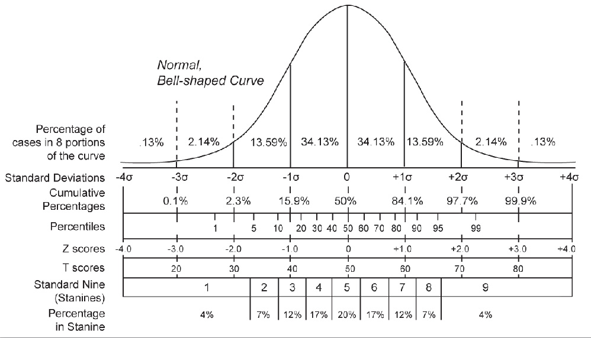
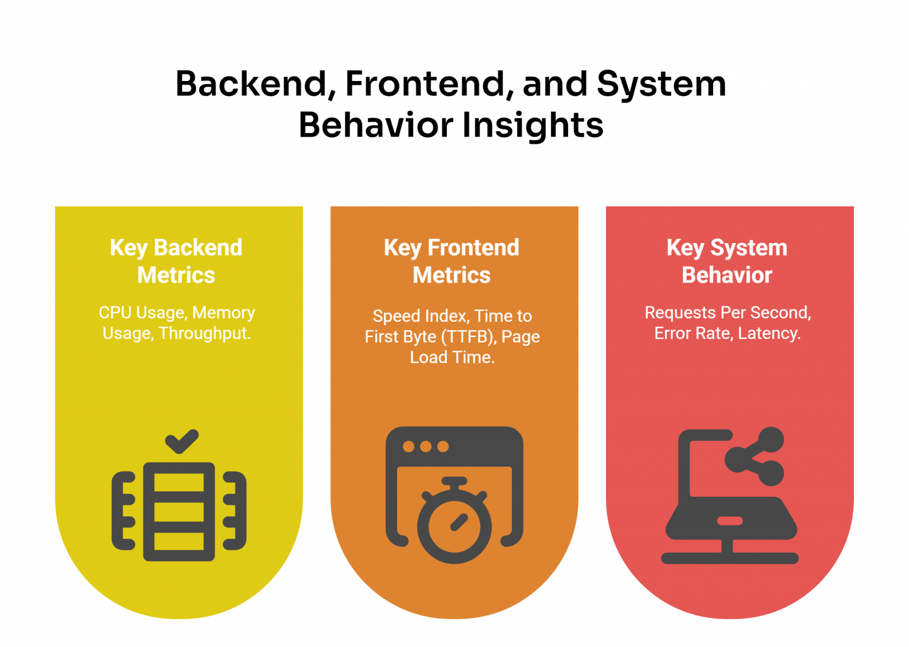
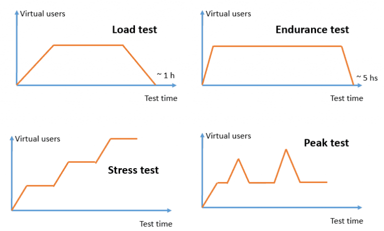

# Table of Contents
- [Table of Contents](#table-of-contents)
  - [Statistical Metrics](#statistical-metrics)
    - [Average Response Time](#average-response-time)
    - [Standard Deviation](#standard-deviation)
    - [Percentiles: p90, p95, and p99](#percentiles-p90-p95-and-p99)
  - [Backend, Frontend, and System Behavior Metrics](#backend-frontend-and-system-behavior-metrics)
    - [Backend Metrics](#backend-metrics)
    - [Frontend Metrics](#frontend-metrics)
    - [System Behavior Metrics](#system-behavior-metrics)
  - [Types of Performance Testing](#types-of-performance-testing)
    - [Performance Testing](#performance-testing)
    - [Load Testing](#load-testing)
    - [Stress Testing](#stress-testing)
    - [Endurance (Soak) Testing](#endurance-soak-testing)
    - [Spike Testing](#spike-testing)
    - [Scalability Testing](#scalability-testing)
  - [SLO, SLA and SLI](#slo-sla-and-sli)
  - [References](#references)

## Statistical Metrics

Evaluating key performance indicators helps confirm that your tests align with business objectives.

### Average Response Time

To calculate the average, simply add up all the values of the samples and then divide that number by the quantity of samples.

> "If I were to put one hand in a bucket of water at -100 degrees Fahrenheit and another hand in a bucket of burning lava, on average, my hand temperature would be fine, but I’d lose both of my hands." 

**It is not recommended to define service level agreements (SLAs) using averages**; instead, have something like *"The service must respond in less than 1 second for 99% of cases."*

### Standard Deviation

Standard deviation is a measure of dispersion concerning the average, how much the values vary for their average, or how far apart they are.

If the value of the standard deviation is small, this indicates that all the values of the samples are close to the average, but if it’s large, then they are far apart and have a greater range.

### Percentiles: p90, p95, and p99

- **The 90th Percentile (p90)**

The 90th percentile (p90) indicates that 90% of the sample values are below this threshold, while the remaining 10% are above it. This is useful for identifying the majority of user experiences and boosting that most users have acceptable response times.

- **The 95th Percentile (p95)**

The 95th percentile (**p95**) shows that 95% of the sample values fall below this threshold, with the remaining 5% above it. This provides a more stringent measure of performance, enabling nearly all users to have a good experience.

- **The 99th Percentile (p99)**

The 99th percentile (**p99**) represents the value below which 99% of the sample falls, leaving only 1% above it. This is particularly useful for identifying outliers and making it possible that even the worst-case scenarios are within acceptable limits.

 > Analyzing multiple percentile values, such as p90, p95, and p99, provides a more detailed view of system performance. 

- **p100**: Represents the maximum value (100% of the data is below this value).
- **p50**: Known as the median (50% of the data is below and 50% is above).

## Backend, Frontend, and System Behavior Metrics

### Backend Metrics

Backend metrics focus on the performance of the server-side infrastructure, which is responsible for processing requests, managing resources, and validating whether the system responds efficiently under load.

**Key Backend Metrics**

- **CPU Usage**: Tracks how much processing power is being used by the server. High CPU usage during peak loads can indicate bottlenecks that need to be addressed.
- **Memory Usage**: Monitors how much memory the server is consuming, helping to identify inefficiencies or potential overloads.
- **Throughput**: Measures the number of requests the server can handle over a specific period, helping to validate whether the system can scale to meet increasing user demands.

### Frontend Metrics

Frontend metrics focus on the user-facing side of the system, evaluating how quickly and efficiently the interface loads and responds to user interactions. These metrics are essential for improving website performance and creating a seamless user experience.

**Key Frontend Metrics**

- **Speed Index**: Assesses how quickly the visible parts of a web page are rendered, providing a clear indicator of perceived performance.

- **Time to First Byte (TTFB)**: Evaluates the time it takes for the browser to receive the first byte of data from the server, which can highlight delays in server response.

- **Page Load Time**: Monitors the total time it takes for a page to fully load, including all assets like images, scripts, and stylesheets.

### System Behavior Metrics

System behavior metrics analyze how the entire system reacts under different conditions, such as high traffic or prolonged usage. They provide a holistic view of performance and help identify patterns that could lead to potential issues.

**Key System Behavior Metrics**

- **Requests Per Second**: Quantifies the number of requests the system can handle, helping to evaluate its capacity under varying loads.
- **Error Rate**: Tracks the percentage of failed requests, which is critical for identifying issues that could disrupt the system’s functionality.
- **Latency**: Calculates the time it takes for a request to travel from the client to the server and back, providing insights into potential delays in the system.

--- 

## Types of Performance Testing

### Performance Testing

Performance testing is a broad category of tests that evaluate system performance (speed, stability, scalability, resource usage) under various loads.

### Load Testing

Checks how a system behaves under the expected user load. Usually involves gradually increasing the load to the peak expected level and holding it there to analyze stability.

### Stress Testing

Pushes the system beyond normal load to find its breaking point and observe how it fails and recovers.

### Endurance (Soak) Testing

Also known as soak testing. The system is tested for hours or days under normal or peak load to detect memory leaks, performance degradation, or other long-term issues.

### Spike Testing

Checks system response to sudden and extreme load spikes — user numbers rise sharply and then drop just as quickly. Useful for scenarios like flash sales or viral events.

### Scalability Testing

Focuses on evaluating how well a system can scale with increased load — both vertically (more powerful hardware) and horizontally (more servers) — while maintaining performance

## SLO, SLA and SLI

- **SLI (Service Level Indicator)** — a quantitative metric that measures the actual performance against the SLO. For example, if your SLA guarantees 99.95% uptime, the SLO might be set to the same target. The SLI is the real measured value, e.g., 99.9% or 99.95%. To meet SLA requirements, the SLI must meet or exceed the promised value.

- **SLO (Service Level Objective)** — the target value for the SLI that the team aims to achieve. For example, “99.9% successful requests over the last 30 days.” It’s an internal goal that sets a threshold for acceptable performance. The SLO serves as the benchmark for evaluating stability.

- **SLA (Service Level Agreement)** — a formal or legal agreement between the service provider and the client. It includes SLOs but adds accountability: penalties, compensation, and commitments. For example: “If uptime drops below 99.5%, the client receives a discount.” SLA is the external framework, SLO is the internal target, and SLI is the measurement of reality.

## References
- https://www.atlassian.com/incident-management/kpis/sla-vs-slo-vs-sli
- https://abstracta.us/blog/performance-testing/performance-testing-metrics/
- https://abstracta.us/blog/performance-testing/types-of-performance-testing/
- https://www.blazemeter.com/blog/performance-testing-vs-load-testing-vs-stress-testing
