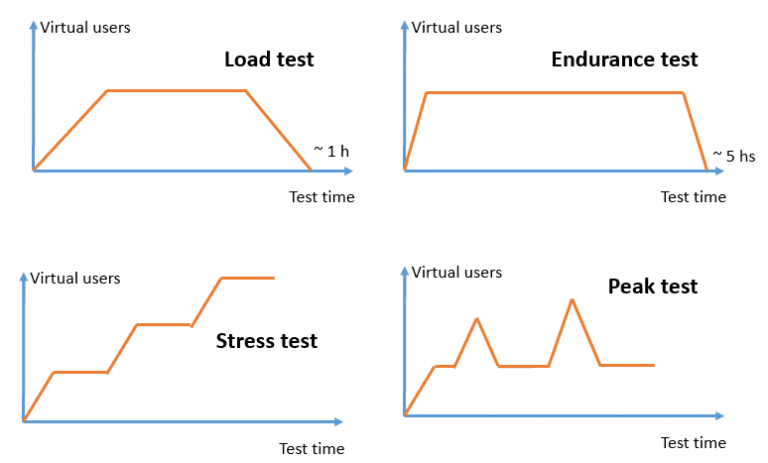

# Table of Contents
- [Table of Contents](#table-of-contents)
  - [General](#general)
    - [Bug report](#bug-report)
    - [Test case](#test-case)
    - [Testing Pyramid](#testing-pyramid)
    - [Levels of Testing](#levels-of-testing)
    - [Test Design Techniques](#test-design-techniques)
      - [Equivalent class partitioning](#equivalent-class-partitioning)
      - [Boundary value analysis](#boundary-value-analysis)
      - [State transition](#state-transition)
      - [Pairwise testing](#pairwise-testing)
      - [Error guessing](#error-guessing)
    - [Test Strategy vs Test Plan](#test-strategy-vs-test-plan)
    - [Test Coverage Metrics](#test-coverage-metrics)
    - [Classification of Different Types of Testing](#classification-of-different-types-of-testing)
  - [Performance testing](#performance-testing)
    - [Statistical Metrics](#statistical-metrics)
      - [Average Response Time](#average-response-time)
      - [Standard Deviation](#standard-deviation)
      - [Percentiles: p90, p95, and p99](#percentiles-p90-p95-and-p99)
    - [Backend, Frontend, and System Behavior Metrics](#backend-frontend-and-system-behavior-metrics)
      - [Backend Metrics](#backend-metrics)
      - [Frontend Metrics](#frontend-metrics)
      - [System Behavior Metrics](#system-behavior-metrics)
    - [Types of Performance Testing](#types-of-performance-testing)
      - [Performance Testing](#performance-testing-1)
      - [Load Testing](#load-testing)
      - [Stress Testing](#stress-testing)
      - [Endurance (Soak) Testing](#endurance-soak-testing)
      - [Spike Testing](#spike-testing)
      - [Scalability Testing](#scalability-testing)
    - [SLO, SLA and SLI](#slo-sla-and-sli)
  - [References](#references)

## General

### Bug report

An effective bug report should contain the following:

- Title/Bug ID
- Environment
- Steps to reproduce a Bug
- Expected Result
- Actual Result
- Visual Proof (screenshots, videos, text) of Bug
- Severity/Priority

---

### Test case
In agile software development, test cases are more like outlines than a list of step-by-step instructions for a single test. Test cases can include details on required conditions, dependencies, procedures, tools, and the expected output. 

:bulb: ***Common elements of a test case include:***

- **Title**:  The title of a test case points to the software feature being tested.
- **Description** (including the test scenario): The description summarizes what is being verified from the test.
- **Test script** (if automated): In automated testing, a test script provides a detailed description of data and actions required for each functionality test.
- **Test ID**: Every test case should bear a unique ID that serves as an identifier to the test case. For clarity, test case ID should follow a standard naming convention.
- **Test environment**: The test environment is the controlled setup or infrastructure where software or systems are tested.
- **Notes**: This section includes any relevant comments or details about the test case that do not fit in any other section of the test case template.

### Testing Pyramid

The pyramid attempts to visually represent a logical organization of testing standards. It consists of three distinct layers.

     

- Unit tests can only find logical errors at the most fundamental level. They are fast and require very few resources to run.
- Integration tests verify that services and databases work well together with the code and the classes you’ve written. They can only find problems at the interfaces where two or more components meet.
- E2E tests depend on the complete application being able to start. These are the most comprehensive type of tests we have and, accordingly, need the most computing resources and time to run.

     

### Levels of Testing

The most common types of testing levels include – unit testing, integration testing, system testing, and acceptance testing. Unit tests focus on individual components, such as methods and functions, while integration tests check if these components work together properly. System tests verify that the entire system meets the functional requirements specified by stakeholders, while acceptance tests validate the software against their criteria for acceptable behavior.

     

---

### Test Design Techniques

#### Equivalent class partitioning

The equivalent class partitioning implies splitting test data into classes, where all elements are similar in some way. This technique makes sense only if the components are similar and can fit in a common group.  

Choosing this technique means that we are going to test only a few values from every group. Remember that doesn’t guarantee that the rest of the values not covered by the tests will be bug-free. We only assume that using several elements from the group will be quite illustrative.  

The equivalent class partitioning is a good solution for cases when you deal with a large volume of incoming data or numerous identical input variations. Otherwise, it might make sense to cover a product with tests more closely.

**Example:**

Let’s say, there is an online store that offers different shipping rates depending on a cart price. For example:  
- The shipping price for orders below $100 is $15.
- The shipping price for orders over $100 is $5.
- Free shipping on orders over $300.   

We have the following price ranges to work with:
- From $1 to $100.
- From $100 to $300.
- $300 and higher.

     

If you use the equivalent class partitioning technique, you get three sets of data to test:

- From $1 to $100:
    - valid boundary conditions: any price in the range from 1 to 99.99;
    - invalid boundary conditions: any price below 1 or above 99.99;

- From $100 to $300:
    - valid boundary conditions: any price in the range from 100 to 299.99;
    - invalid boundary conditions: any price below 100 or above 299.99;

- $300 and higher:
    - valid boundary conditions: any price above 299.99;
    - invalid boundary conditions: any price below 300.

     

#### Boundary value analysis

The boundary value analysis is similar to the previous technique. Some may even say it is based on the equivalent class partitioning. So what makes the boundary value analysis different?  

We still group data in equivalent classes but don’t test values from a particular class only. Instead, we check boundary values, those that are at the ‘borders’ of the classes. The same logic works perfectly for integration testing. We check smaller elements during unit testing, and on the next level, the errors are likely to pop up at the unit junctions.

**Example:**

Let’s take the previous scenario with varying shipping rates. We have the same data but a different approach to using it. Assuming that errors are the most likely to occur at the boundaries, we test only the 'boundary' numbers:  
- From $1 to $100:
    - valid boundary conditions: 1.00, 1.01, 99.99;
    - invalid boundary conditions: 0.99, 100.00, 100.01; 

- From $100 to $300:
    - valid boundary conditions: 100.00, 100.01, 299.99;
    - invalid boundary conditions: 99.99, 300.00; 

- $300 and higher:
    - valid boundary conditions: 300.00, 300.01;
    - invalid boundary conditions: 299.99.

     

#### State transition

The state transition visualizes the states of a software system at different time frames and stages of usage. Visual information is simpler to perceive compared to verbal description. Therefore, the state transition allows you to come up with ultimate test coverage more quickly. This technique is effective for creating test suites for systems that have many state variations. It will be helpful if you test a sequence of events with a finite number of input options.

**Example:**

The simplest example of the state transition is visualizing logging into an account during web or mobile app testing. Let’s say, we are testing a system that offers a limited number of attempts to enter a correct password. If a user fails to enter a correct password, the system blocks the access (temporarily or permanently, it doesn’t matter now). A logic diagram would look like this:

     

Blocks of different colors designate specific states of the system. Let’s add the labels designating states, and we’ll get the following:

     

A chart like this makes it easier to match possible inputs with expected outputs. Having a visualization right in front of your eyes helps to keep a clear head and connect the states correctly. You can later arrange the data concisely and conveniently – for example, in a table to look up to during testing:

     

#### Pairwise testing

The pairwise testing is considered the most difficult and confusing of the five test design techniques. And there is a good reason for this. The pairwise testing is based on mathematical algorithms, namely combinatorics. It makes it possible to create unique pairs and test a huge amount of incoming data in different combinations, but the calculations might get complicated. To cover the maximum of features with test scripts that will require minimum time for testing, you need to match data correctly, combining pairs in a specific way based on the calculations.

**Example:**

Let’s say, there is a network of bakeries selling apple pies and cheesecakes online. Each is available in three sizes – small, medium, and big. The bakery offers immediate and scheduled address delivery, as well as a pick-up option. The bakery works in three cities – New York, Los Angeles, and Chicago. Also, a user can order up to three items at a time.

     

If you want to test all possible inputs, that would be 2x3x3x3x2x2=216 valid order combinations. However, checking each of those would be unreasonable. Instead, you can arrange the variables in a way that will allow covering maximum scenarios. To do this, you'll need to group the variables or use one of the tools that can do it for you. We used [Pairwise Online Tool](https://pairwise.teremokgames.com/) o create this example. As a result, we got 17 scenarios able to cover all 216 combinations. You can see the list of combinations below.

     

#### Error guessing

Error guessing is the most experimental practice of all, usually applied along with another test design technique. In error guessing, a QA engineer predicts where errors are likely to appear, relying on previous experience, knowledge of the system, and product requirements. Thus, a QA specialist is to identify spots where defects tend to accumulate and pay increased attention to those areas.

**Example:**

- As a rule, QA engineers start with testing for common mistakes, such as:
- Entering blank spaces in text fields.
- Pressing the Submit button without entering data.
- Entering invalid parameters (email address instead of a phone number, etc.).
- Uploading files that exceed the maximum limit.
- ... and so on.

### Test Strategy vs Test Plan

Simply put, both the Test Plan and Test Strategy are essential documents in the testing process, but they serve different purposes and address different levels of detail. The Test Plan focuses on the specifics of testing for a particular project, while the Test Strategy sets the overarching approach and principles for testing across projects or the entire organization.

| Aspect                   | Test Plan                                                                                                                         | Test Strategy                                                                                                                                     |
| ------------------------ | --------------------------------------------------------------------------------------------------------------------------------- | ------------------------------------------------------------------------------------------------------------------------------------------------- |
| **Definition**           | A Test Plan outlines the approach, scope, objectives, resources, and schedule for testing a specific project or product.          | A Test Strategy defines the high-level approach to testing for an organization or a project, guiding the overall testing process.                 |
| **Scope**                | Focuses on the details of how testing will be carried out for a specific project.                                                 | Encompasses a broader perspective, outlining principles, objectives, and methods to achieve consistent testing across projects.                   |
| **Purpose**              | Provides a detailed roadmap for the testing activities, including what, when, and how to test.                                    | Sets the direction for testing efforts, aligning them with the organization's goals and helping in making important testing decisions.            |
| **Audience**             | Primarily for the project team, including testers, developers, managers, and stakeholders.                                        | Aimed at management, project leads, and high-level stakeholders involved in decision-making for testing strategies.                               |
| **Contents**             | Includes test scope, objectives, resources, schedule, test environment, test cases, entry/exit criteria, risks, and deliverables. | Covers testing approach, testing types (functional, performance, security, etc.), tools, defect management, risk assessment, and overall process. |
| **Level of Detail**      | Provides a detailed breakdown of test activities, including specific test cases, procedures, and schedules.                       | Offers a broader overview of the testing approach, principles, and guidelines, rather than focusing on specific details.                          |
| **Timeframe**            | Typically created for a specific project phase or release.                                                                        | Generally applies to multiple projects or the entire organization and is less time-bound.                                                         |
| **Flexibility**          | More rigid and specific to the project, allowing less flexibility to adapt to changing circumstances.                             | Offers more flexibility in adapting to various project needs, as it doesn't delve into specifics.                                                 |
| **Dependencies**         | Based on the broader guidelines outlined in the Test Strategy.                                                                    | Driven by the organization's policies, best practices, and project-specific requirements.                                                         |
| **Communication**        | Essential for aligning the project team and stakeholders on the testing approach and execution.                                   | Ensures that testing efforts are aligned with the overall organizational goals and standards.                                                     |
| **Revision and Updates** | Needs to be updated more frequently, especially with changes in project scope or requirements.                                    | Changes less frequently and provides a stable framework for testing efforts across multiple projects.                                             |
| **Example Use Case**     | Creating a detailed plan for testing a specific software release or product update.                                               | Establishing guidelines for how various types of testing (functional, performance, etc.) will be conducted within the organization.               |

---

### Test Coverage Metrics

:memo: ***Functional Coverage***
It defines how much coverage the test plan provides for the business and functional requirements. Function coverage is a metric measuring the functions invoked during software testing. The number of functions executed by a test suite is divided by the total number of functions in the software under testing to calculate this metric. It does not assign a value to each function individually, as branch coverage or statement coverage does. Instead, it simply determines whether each function was called by the tests you were running.

:memo: ***Test Execution Coverage***
It defines what is the percentage of test execution vs the total test case count. It helps understand the amount of test coverage in terms of absolute numbers. This widely helps in understanding the pass or fail rate of the test build.

:memo: ***Requirements Coverage***
It defines how much of the business requirements suggested by the stakeholders are covered in the existing test plan. Requirements coverage can be deciphered by comparing the number of requirements that are fully covered by the test scenarios vs those partially covered or not covered by the test scenarios. 

:memo: ***Product Coverage***
It defines the scope of the test, in terms of the number of products that the product is tested on. For example, a web application that is tested on various desktops, mobiles, and tablets, covers a large number of devices that the application would be accessed on. 

The larger the product coverage, the more it gives confidence for a smoother consistent user experience. Especially, now when the users have access to different types of devices and platforms and companies trying to provide a multi-experience to the users seamlessly across different devices and platforms.

Cross platform compatibility and Cross-Browser Compatibility tests are the biggest examples, where product coverage plays a major role in determining the quality of the software.

:memo: ***Risk Coverage***
It defines the risk faced by the software application when in real use, which is covered by the tests. These risks are mainly the constraints that may cause any negative impact on the user experience. Once the risks are known, testing can be structured to ensure that potential risks are not translated into actual negative consequences. When tests are designed to cover said risks, the software stands a much higher chance of attaining technical and commercial success.

Take an app for stock market investment, for example. Let’s say it uses a third-party API to search and retrieve financial data – exchange rates, stock prices, etc. If this API becomes unresponsive (a major risk), how would the app respond?

Risk coverage would take this into account and design tests accordingly to ensure the software does not become paralyzed and useless if such a risk occurs.

---

### Classification of Different Types of Testing

Testing is divided into two types – *Functional* Testing and *Non functional* Testing

     

---

## Performance testing

### Statistical Metrics

Evaluating key performance indicators helps confirm that your tests align with business objectives.

     

#### Average Response Time

To calculate the average, simply add up all the values of the samples and then divide that number by the quantity of samples.

> "If I were to put one hand in a bucket of water at -100 degrees Fahrenheit and another hand in a bucket of burning lava, on average, my hand temperature would be fine, but I’d lose both of my hands." 

**It is not recommended to define service level agreements (SLAs) using averages**; instead, have something like *"The service must respond in less than 1 second for 99% of cases."*

#### Standard Deviation

Standard deviation is a measure of dispersion concerning the average, how much the values vary for their average, or how far apart they are.

If the value of the standard deviation is small, this indicates that all the values of the samples are close to the average, but if it’s large, then they are far apart and have a greater range.

#### Percentiles: p90, p95, and p99

- **The 90th Percentile (p90)**

The 90th percentile (p90) indicates that 90% of the sample values are below this threshold, while the remaining 10% are above it. This is useful for identifying the majority of user experiences and boosting that most users have acceptable response times.

- **The 95th Percentile (p95)**

The 95th percentile (**p95**) shows that 95% of the sample values fall below this threshold, with the remaining 5% above it. This provides a more stringent measure of performance, enabling nearly all users to have a good experience.

- **The 99th Percentile (p99)**

The 99th percentile (**p99**) represents the value below which 99% of the sample falls, leaving only 1% above it. This is particularly useful for identifying outliers and making it possible that even the worst-case scenarios are within acceptable limits.

 > Analyzing multiple percentile values, such as p90, p95, and p99, provides a more detailed view of system performance. 

- **p100**: Represents the maximum value (100% of the data is below this value).
- **p50**: Known as the median (50% of the data is below and 50% is above).

### Backend, Frontend, and System Behavior Metrics

     

#### Backend Metrics

Backend metrics focus on the performance of the server-side infrastructure, which is responsible for processing requests, managing resources, and validating whether the system responds efficiently under load.

**Key Backend Metrics**

- **CPU Usage**: Tracks how much processing power is being used by the server. High CPU usage during peak loads can indicate bottlenecks that need to be addressed.
- **Memory Usage**: Monitors how much memory the server is consuming, helping to identify inefficiencies or potential overloads.
- **Throughput**: Measures the number of requests the server can handle over a specific period, helping to validate whether the system can scale to meet increasing user demands.

#### Frontend Metrics

Frontend metrics focus on the user-facing side of the system, evaluating how quickly and efficiently the interface loads and responds to user interactions. These metrics are essential for improving website performance and creating a seamless user experience.

**Key Frontend Metrics**

- **Speed Index**: Assesses how quickly the visible parts of a web page are rendered, providing a clear indicator of perceived performance.

- **Time to First Byte (TTFB)**: Evaluates the time it takes for the browser to receive the first byte of data from the server, which can highlight delays in server response.

- **Page Load Time**: Monitors the total time it takes for a page to fully load, including all assets like images, scripts, and stylesheets.

#### System Behavior Metrics

System behavior metrics analyze how the entire system reacts under different conditions, such as high traffic or prolonged usage. They provide a holistic view of performance and help identify patterns that could lead to potential issues.

**Key System Behavior Metrics**

- **Requests Per Second**: Quantifies the number of requests the system can handle, helping to evaluate its capacity under varying loads.
- **Error Rate**: Tracks the percentage of failed requests, which is critical for identifying issues that could disrupt the system’s functionality.
- **Latency**: Calculates the time it takes for a request to travel from the client to the server and back, providing insights into potential delays in the system.

--- 

### Types of Performance Testing

#### Performance Testing

Performance testing is a broad category of tests that evaluate system performance (speed, stability, scalability, resource usage) under various loads.

     

#### Load Testing

Checks how a system behaves under the expected user load. Usually involves gradually increasing the load to the peak expected level and holding it there to analyze stability.

#### Stress Testing

Pushes the system beyond normal load to find its breaking point and observe how it fails and recovers.

#### Endurance (Soak) Testing

Also known as soak testing. The system is tested for hours or days under normal or peak load to detect memory leaks, performance degradation, or other long-term issues.

#### Spike Testing

Checks system response to sudden and extreme load spikes — user numbers rise sharply and then drop just as quickly. Useful for scenarios like flash sales or viral events.

#### Scalability Testing

Focuses on evaluating how well a system can scale with increased load — both vertically (more powerful hardware) and horizontally (more servers) — while maintaining performance

### SLO, SLA and SLI

- **SLI (Service Level Indicator)** — a quantitative metric that measures the actual performance against the SLO. For example, if your SLA guarantees 99.95% uptime, the SLO might be set to the same target. The SLI is the real measured value, e.g., 99.9% or 99.95%. To meet SLA requirements, the SLI must meet or exceed the promised value.

- **SLO (Service Level Objective)** — the target value for the SLI that the team aims to achieve. For example, “99.9% successful requests over the last 30 days.” It’s an internal goal that sets a threshold for acceptable performance. The SLO serves as the benchmark for evaluating stability.

- **SLA (Service Level Agreement)** — a formal or legal agreement between the service provider and the client. It includes SLOs but adds accountability: penalties, compensation, and commitments. For example: “If uptime drops below 99.5%, the client receives a discount.” SLA is the external framework, SLO is the internal target, and SLI is the measurement of reality.

## References
- https://semaphoreci.com/blog/testing-pyramid
- https://testsigma.com/blog/qa-interview-questions
- https://katalon.com/resources-center/blog/test-plan   
- https://www.browserstack.com/guide/types-of-testing
- https://www.browserstack.com/guide/how-to-write-a-bug-report
- https://www.testrail.com/blog/effective-test-cases-templates
- https://www.qamadness.com/5-test-design-techniques-qa-engineers-should-know

- https://www.browserstack.com/guide/test-coverage-metrics-in-software-testing 
- https://www.atlassian.com/incident-management/kpis/sla-vs-slo-vs-sli
- https://abstracta.us/blog/performance-testing/performance-testing-metrics/
- https://abstracta.us/blog/performance-testing/types-of-performance-testing/
- https://www.blazemeter.com/blog/performance-testing-vs-load-testing-vs-stress-testing

- https://codoid.com/performance-testing/jmeter-tutorial-an-end-to-end-guide/
- https://krython.com/tutorial/python/performance-testing-load-testing-with-locust